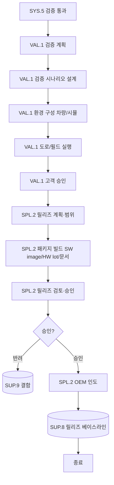

# 검증 및 인도 프로세스 (PRO-SPICE-01-05)

> 상위 정책: [[POL-SPICE-01_ASPICE역량거버넌스정책]]
> 적용요건: [[적용요건]] §1.1 SPL.2, §1.3 VAL.1
> 입력: business_flow.yaml SCN-013 (Validation), SCN-014 (Release)

---

## 1. 목적

시스템 검증(SYS.5) 통과 후 **운영 환경에서의 사용자 의도 충족 검증(VAL.1)** 과 **통합·일관된 제품 릴리즈의 형식화·통제·인도(SPL.2)** 를 통해, OEM 에 ASPICE·고객 계약을 충족하는 양산 단계 제품을 인도한다. SOP/PV/EOP 게이트와 연동된다.

## 2. 적용 범위

VWAY Motors 가 OEM 에 인도하는 모든 양산 SW/HW 제품 릴리즈에 적용한다. 사내 시제·연구용 빌드는 본 절차 대상이 아니나, OEM 데모용 빌드는 SPL.2 BP1 (릴리즈 범위 정의) 만 적용한다.

## 3. 역할과 책임 (RACI)

| 단계 | Validation Engineer | Release Manager | QA (SUP.1) | CM (SUP.8) | Customer (OEM) |
|---|---|---|---|---|---|
| 검증 계획 (VAL.1) | **R** | C | C | I | C |
| 도로/필드 검증 실행 | **R** | I | C | I | C |
| 고객 승인 (VAL.1.BP4) | C | **R** | C | I | **A** |
| 릴리즈 패키지 빌드 (SPL.2) | I | **R** | C | C | I |
| 릴리즈 검토·승인 | I | **R** | **A(QA)** | C | C |
| OEM 인도 (SPL.2.BP6) | I | **R** | I | C | **A** |
| 베이스라인 등록 | I | C | I | **A(CM)** | I |

## 4. 절차 흐름



## 5. 단계별 상세

| # | 단계 | ASPICE BP | 설명 | 입력 | 출력 |
|---|---|---|---|---|---|
| 1 | 검증 계획 | VAL.1.BP1 | 검증 범위·전략·자원 | SyRS, OEM 요구 | Validation Plan |
| 2 | 시나리오 설계 | VAL.1.BP2 | 도로·필드 시나리오 + 환경 변수 | Plan | Validation Spec |
| 3 | 검증 환경 구성 | VAL.1.BP2 | 실차/시뮬·도구 통제 | Spec | Env. Config Record |
| 4 | 검증 실행 | VAL.1.BP3/4 | 도로/필드 시험·결과 기록 | Env, Spec | Validation Report |
| 5 | 고객 승인 | VAL.1.BP4 | OEM sign-off | Validation Report | 승인서 |
| 6 | 릴리즈 계획 | SPL.2.BP1 | 릴리즈 범위·구성·일정 | OEM 요구, CM 상태 | Release Plan |
| 7 | 패키지 빌드 | SPL.2.BP3 | SW image, HW lot, 문서 | Plan, Build Artifacts | Release Package |
| 8 | 릴리즈 검토·승인 | SPL.2.BP5 | QA·Release Manager 합의 | Package | Release 승인 |
| 9 | OEM 인도 | SPL.2.BP6 | 인도 + 인도 증적 | Package | 인도 확인서 |
| 10 | 베이스라인 등록 | SUP.8 | 형상 베이스라인 lock | Release | CM Baseline |

## 6. 연계 업무지침 (WI)

- [[WI-SPICE-01-05-01_검증계획수립]]
- [[WI-SPICE-01-05-02_도로및필드검증]]
- [[WI-SPICE-01-05-03_고객승인]]
- [[WI-SPICE-01-05-04_릴리즈패키지빌드]]
- [[WI-SPICE-01-05-05_OEM인도]]

## 7. 통제점 / KPI

| 통제점 | 지표 | 목표 | 주기 |
|---|---|---|---|
| 검증 시나리오 커버리지 | ODD/사용 시나리오 vs Spec | ≥ 95% | 검증별 |
| 고객 승인 적시성 | 검증 완료→sign-off | ≤ 10 영업일 | 릴리즈별 |
| 릴리즈 완전성 | 패키지 누락 항목 | 0건 | 릴리즈별 |
| 인도 적시성 | 합의 일정 vs 실제 | 100% on-time | 릴리즈별 |
| 릴리즈 후 결함 | OEM 보고 결함 (30일) | ≤ 1건 / 릴리즈 | 릴리즈별 |

## 8. 표준 매핑 (Traceability)

| ASPICE 조항 | Req-ID | 반영 |
|---|---|---|
| VAL.1 Purpose / BP2 / BP4 | SPICE-VAL1-R-001/002/003 | §5 단계 1~5 |
| SPL.2 Purpose / BP1 / BP4 | SPICE-SPL2-R-001/002/003 | §5 단계 6~10 |

## 9. 출처 (source_citation)

```yaml
- type: standard_original
  file: "inputs/01_표준원문/VWAY_Motors/requirements.yaml"
  locator: "VWAY-VAL.1-*, VWAY-SPL.2-*"
  retrieved_at: "2026-05-06"
  license: "ASPICE 4.0 © VDA QMC — paraphrase only"
  paraphrase_only: true
- type: standard_original
  file: "inputs/06_목표흐름/business_flow.yaml"
  locator: "SCN-013 ~ SCN-014"
  retrieved_at: "2026-05-06"
```

## 10. 개정 이력

| 버전 | 일자 | 변경내용 | 승인자 |
|---|---|---|---|
| 0.1 | 2026-05-06 | 최초 초안 — VAL.1 + SPL.2 통합 절차 정의 | (대기) |
