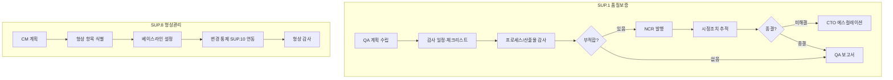

# 품질보증 및 형상관리 프로세스 (PRO-SPICE-01-07)

> 상위 정책: [[POL-SPICE-01_ASPICE역량거버넌스정책]]
> 적용요건: [[적용요건]] §1.7 SUP.1, SUP.8
> 입력: business_flow.yaml SCN-019 (QA·CM)

---

## 1. 목적

**SUP.1 (Quality Assurance)** 의 독립적 프로세스/산출물 감사·시정 추적·에스컬레이션 권한 행사, 그리고 **SUP.8 (Configuration Management)** 의 형상 항목 식별·기준선 설정·변경 통제·이력 보존을 통합 운영한다.

## 2. 적용 범위

VWAY Motors 의 모든 ASPICE 영역(SYS·SWE·HWE·MLE·VAL·SPL·MAN·SUP·PIM·REU) 의 프로세스 활동·작업 산출물에 적용한다. QA 의 독립성 확보(POL §3 원칙 4) 가 본 절차의 핵심 보장 사항이다.

## 3. 역할과 책임 (RACI)

| 단계 | QA Lead | QA Engineer | CM Lead | Process Owner | CTO |
|---|---|---|---|---|---|
| QA 계획 (SUP.1.BP1) | **A** | **R** | I | C | I |
| 감사 실행 (SUP.1.BP3) | A | **R** | I | C | I |
| 부적합 보고·시정 추적 | **A** | R | I | **R** | I |
| 에스컬레이션 (SUP.1.BP4) | **A** | C | I | I | **R(수신)** |
| CM 계획 (SUP.8.BP1) | C | I | **A** | C | I |
| 형상 항목 식별 (SUP.8.BP2) | C | I | **R** | C | I |
| 베이스라인 통제 (SUP.8.BP4) | C | I | **A** | C | I |
| 형상 감사 (SUP.8.BP6) | A | R | C | I | I |

## 4. 절차 흐름



## 5. 단계별 상세

| # | 단계 | ASPICE BP | 설명 | 입력 | 출력 |
|---|---|---|---|---|---|
| 1 | QA 계획 | SUP.1.BP1 | 감사 범위·일정·자원 | 프로젝트 계획 | QA Plan |
| 2 | 감사 실행 | SUP.1.BP3 | 프로세스·산출물 감사 | QA Plan | 감사 기록 |
| 3 | NCR + 시정 추적 | SUP.1.BP3/5 | 부적합 등록·시정·검증 | 감사 결과 | NCR + 시정 보고 |
| 4 | QA 보고 | SUP.1.BP3 | 경영진 보고 | NCR, 시정 | QA Report |
| 5 | 에스컬레이션 | SUP.1.BP4 | 미해결 시 CTO/CEO | 미해결 NCR | 에스컬레이션 기록 |
| 6 | CM 계획 | SUP.8.BP1 | 형상 항목·도구·역할 | 프로젝트 계획 | CM Plan |
| 7 | 형상 항목 식별 | SUP.8.BP2 | CI 목록·식별자 | CM Plan | CI List |
| 8 | 베이스라인 설정·통제 | SUP.8.BP3/4 | baseline lock + 변경 통제 | CI, 승인 | Baseline Records |
| 9 | 형상 감사 | SUP.8.BP6 | physical/functional CM audit | CI, Baseline | CM Audit Report |

## 6. 연계 업무지침 (WI)

- [[WI-SPICE-01-07-01_QA계획수립]]
- [[WI-SPICE-01-07-02_QA감사실시]]
- [[WI-SPICE-01-07-03_시정조치및에스컬레이션]]
- [[WI-SPICE-01-07-04_형상항목식별]]
- [[WI-SPICE-01-07-05_베이스라인및변경통제]]
- [[WI-SPICE-01-07-06_형상감사]]

## 7. 통제점 / KPI

| 통제점 | 지표 | 목표 | 주기 |
|---|---|---|---|
| QA 감사 수행률 | 계획 대비 실행 | ≥ 95% | 분기 |
| NCR 종결률 | 기한 내 시정 종결 | ≥ 90% | 월 |
| 에스컬레이션 미회신 | CTO 응답 지연 | 0건 | 월 |
| 베이스라인 무결성 | 형상 감사 부적합 | 0건 | 마일스톤 |
| 미관리 형상 항목 | CI 누락 건수 | 0건 | 월 |

## 8. 표준 매핑 (Traceability)

| ASPICE 조항 | Req-ID | 반영 |
|---|---|---|
| SUP.1 Purpose / BP3 / BP4 | SPICE-SUP1-R-001/002/003 | §5 단계 1~5 |
| SUP.8 Purpose / BP2 / BP4 | SPICE-SUP8-R-001/002/003 | §5 단계 6~9 |

## 9. 출처 (source_citation)

```yaml
- type: standard_original
  file: "inputs/01_표준원문/VWAY_Motors/requirements.yaml"
  locator: "VWAY-SUP.1-*, VWAY-SUP.8-*"
  retrieved_at: "2026-05-06"
  license: "ASPICE 4.0 © VDA QMC — paraphrase only"
  paraphrase_only: true
- type: standard_original
  file: "inputs/06_목표흐름/business_flow.yaml"
  locator: "SCN-019"
  retrieved_at: "2026-05-06"
```

## 10. 개정 이력

| 버전 | 일자 | 변경내용 | 승인자 |
|---|---|---|---|
| 0.1 | 2026-05-06 | 최초 초안 — SUP.1 + SUP.8 통합 절차 정의 | (대기) |
