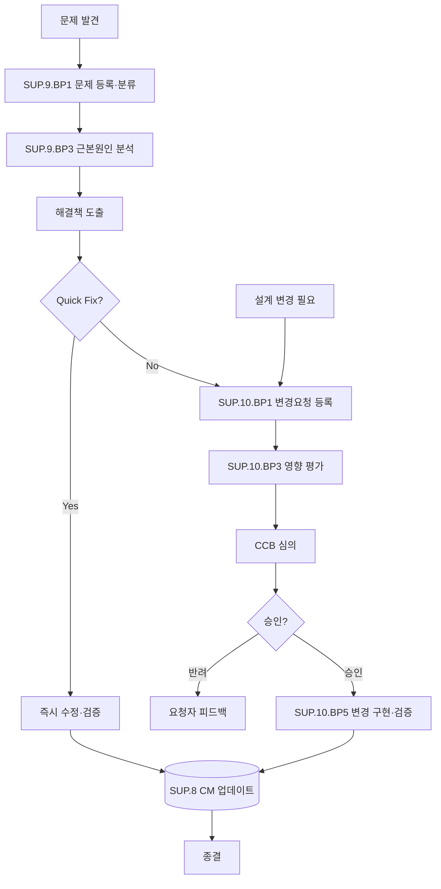

# 문제 및 변경 관리 프로세스 (PRO-SPICE-01-08)

> 상위 정책: [[POL-SPICE-01_ASPICE역량거버넌스정책]]
> 적용요건: [[적용요건]] §1.7 SUP.9, SUP.10
> 입력: business_flow.yaml SCN-020 (변경·문제 처리)

---

## 1. 목적

검증·운영·고객 피드백 등에서 발견되는 **문제(Non-conformance / Defect / Problem) 의 식별·분석·해결 추적(SUP.9)** 과 **변경요청(Change Request) 의 식별·평가·승인·실행(SUP.10)** 을 통합 운영하여, 통제되지 않은 변경·미해결 결함을 예방한다.

## 2. 적용 범위

VWAY Motors 의 모든 작업 산출물(요구사항·아키텍처·설계·코드·HW·ML 모델·데이터·문서) 의 변경 및 모든 발견된 문제에 적용한다. 단순 오탈자 등 형식적 수정도 SUP.10 경미 변경 경로로 처리한다.

## 3. 역할과 책임 (RACI)

| 단계 | 발견자 | Process Owner | CCB | QA (SUP.1) | CM (SUP.8) | CTO |
|---|---|---|---|---|---|---|
| 문제 등록 (SUP.9.BP1) | **R** | C | I | I | I | I |
| 근본원인 분석 (SUP.9.BP3) | C | **R** | I | C | I | I |
| 문제 해결·검증 | I | **R** | I | **A(QA)** | C | I |
| CR 등록 (SUP.10.BP1) | **R** | C | I | I | I | I |
| 영향 평가 (SUP.10.BP3) | I | **R** | C | C | C | I |
| CCB 승인 (SUP.10.BP4) | I | C | **A** | C | C | I/A(중대) |
| 변경 구현·검증 | I | **R** | I | C | C | I |
| CM 업데이트 | I | C | I | I | **A** | I |

> 안전성/규제 영향 변경은 CTO 가 최종 A.

## 4. 절차 흐름



## 5. 단계별 상세

| # | 단계 | ASPICE BP | 설명 | 입력 | 출력 |
|---|---|---|---|---|---|
| 1 | 문제 등록 | SUP.9.BP1 | 식별·분류·우선순위 | 발견 | Problem Ticket |
| 2 | 근본원인 분석 | SUP.9.BP3 | RCA (5-why, fishbone) | Ticket | RCA 보고 |
| 3 | 해결책 도출·검증 | SUP.9.BP4 | 수정·검증 | RCA | Resolved Ticket |
| 4 | CR 등록 | SUP.10.BP1 | 변경 사항·요청자 정보 | 변경 필요 | Change Request |
| 5 | 영향 평가 | SUP.10.BP3 | 비용·일정·기술·안전성 | CR | 영향평가서 |
| 6 | CCB 심의 | SUP.10.BP4 | 승인/반려 결정 | 영향평가서 | CCB 의사록 |
| 7 | 변경 구현·검증 | SUP.10.BP5 | 구현·테스트 | 승인 | 변경 산출물 + 검증 보고 |
| 8 | CM 업데이트 | SUP.8 | 베이스라인 갱신 | 변경 산출물 | CM Baseline |

## 6. 연계 업무지침 (WI)

- [[WI-SPICE-01-08-01_문제등록및분류]]
- [[WI-SPICE-01-08-02_근본원인분석]]
- [[WI-SPICE-01-08-03_변경요청접수]]
- [[WI-SPICE-01-08-04_영향평가]]
- [[WI-SPICE-01-08-05_CCB운영]]
- [[WI-SPICE-01-08-06_변경구현및검증]]

## 7. 통제점 / KPI

| 통제점 | 지표 | 목표 | 주기 |
|---|---|---|---|
| 문제 등록 적시성 | 발견→등록 | ≤ 1 영업일 | 월 |
| RCA 완료율 | Major 결함 RCA | 100% | 월 |
| CR 처리 리드타임 | 등록→승인/반려 | ≤ 5 영업일 | 월 |
| 미승인 변경 | 승인 없는 산출물 변경 | 0건 | 분기 |
| 결함 재발율 | 동일 RC 재발 | 추세 감소 | 분기 |

## 8. 표준 매핑 (Traceability)

| ASPICE 조항 | Req-ID | 반영 |
|---|---|---|
| SUP.9 Purpose / BP3 | SPICE-SUP9-R-001/002 | §5 단계 1~3 |
| SUP.10 Purpose / BP3 | SPICE-SUP10-R-001/002 | §5 단계 4~7 |

## 9. 출처 (source_citation)

```yaml
- type: standard_original
  file: "inputs/01_표준원문/VWAY_Motors/requirements.yaml"
  locator: "VWAY-SUP.9-*, VWAY-SUP.10-*"
  retrieved_at: "2026-05-06"
  license: "ASPICE 4.0 © VDA QMC — paraphrase only"
  paraphrase_only: true
- type: standard_original
  file: "inputs/06_목표흐름/business_flow.yaml"
  locator: "SCN-020"
  retrieved_at: "2026-05-06"
```

## 10. 개정 이력

| 버전 | 일자 | 변경내용 | 승인자 |
|---|---|---|---|
| 0.1 | 2026-05-06 | 최초 초안 — SUP.9 + SUP.10 통합 절차 정의 | (대기) |
