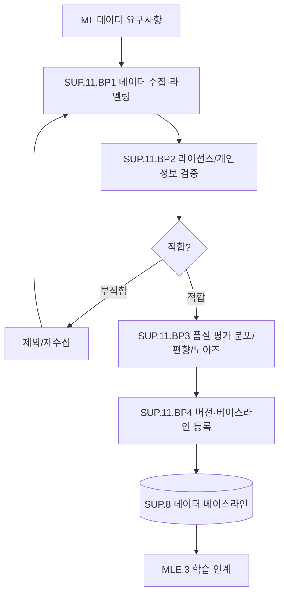

# ML 데이터 관리 프로세스 (PRO-SPICE-01-10)

> 상위 정책: [[POL-SPICE-01_ASPICE역량거버넌스정책]]
> 적용요건: [[적용요건]] §1.7 SUP.11 — ASPICE 4.0 신규
> 입력: business_flow.yaml SCN-011, SCN-012 (ML 데이터 노드)

---

## 1. 목적

ML 모델 학습·검증·테스트에 사용되는 **데이터셋의 식별·수집·품질평가·라이선스 적합성·개인정보 처리·버전 관리·재현성** 을 통제된 흐름으로 운영한다 (SUP.11). [[PRO-SPICE-01-04_머신러닝공학프로세스]] 의 학습·테스트 단계의 입력 보장을 책임진다.

## 2. 적용 범위

VWAY Motors 가 자체 수집·구매·라이선스 받은 모든 ML 데이터셋(이미지·LiDAR·Radar·CAN log·운전자 행동) 에 적용한다. 단순 사내 통계용 데이터(개발 metric 등) 는 본 절차 대상이 아니다.

## 3. 역할과 책임 (RACI)

| 단계 | Data Engineer | Data Steward | Legal/Privacy | QA (SUP.1) | ML Lead |
|---|---|---|---|---|---|
| 데이터 수집·라벨링 (SUP.11.BP1) | **R** | C | C | I | A |
| 라이선스/개인정보 검증 (SUP.11.BP2) | C | **R** | **A** | I | I |
| 품질 평가 (SUP.11.BP3) | **R** | C | I | C | A |
| 버전·베이스라인 (SUP.11.BP4) | **R** | **A** | I | C | C |

## 4. 절차 흐름



## 5. 단계별 상세

| # | 단계 | ASPICE BP | 설명 | 입력 | 출력 |
|---|---|---|---|---|---|
| 1 | 데이터 수집·라벨링 | SUP.11.BP1 | 도로 주행/시뮬·라벨링 가이드 | 데이터 요구 | Raw Dataset + Labels |
| 2 | 라이선스/개인정보 검증 | SUP.11.BP2 | 출처·라이선스·PII 처리 | Raw Dataset | 라이선스 대장 |
| 3 | 품질 평가 | SUP.11.BP3 | 분포·편향·노이즈·라벨 일치율 | Dataset | 품질 보고 |
| 4 | 버전·베이스라인 등록 | SUP.11.BP4 | dataset hash·버전·메타 | Dataset | Dataset Baseline |
| 5 | 재현성 확보 | SUP.11.BP4 | seed·split·환경 정보 보존 | Baseline | 재현성 메타 |

## 6. 연계 업무지침 (WI)

- [[WI-SPICE-01-10-01_데이터수집및라벨링]]
- [[WI-SPICE-01-10-02_라이선스및개인정보검증]]
- [[WI-SPICE-01-10-03_데이터품질평가]]
- [[WI-SPICE-01-10-04_데이터버전및베이스라인]]

## 7. 통제점 / KPI

| 통제점 | 지표 | 목표 | 주기 |
|---|---|---|---|
| 라이선스 위반 | 부적합 데이터 사용 | 0건 | 분기 |
| PII 노출 | 미마스킹 PII 비율 | 0건 | 데이터셋별 |
| 라벨 일치율 | 검수자 간 일치율 (IoU/κ) | ≥ 95% | 데이터셋별 |
| 데이터셋 버전 추적 | 학습↔dataset 버전 link | 100% | 학습별 |
| 데이터 분포 편향 | 보호 속성 편향도 | ≤ 정의 임계 | 데이터셋별 |

## 8. 표준 매핑 (Traceability)

| ASPICE 조항 | Req-ID | 반영 |
|---|---|---|
| SUP.11 Purpose | SPICE-SUP11-R-001 | §1, §4 전체 |
| SUP.11.BP2 (라이선스) | SPICE-SUP11-R-002 | §5 단계 2 |
| SUP.11.BP4 (버전·재현성) | SPICE-SUP11-R-003 | §5 단계 4~5 |

## 9. 출처 (source_citation)

```yaml
- type: standard_original
  file: "inputs/01_표준원문/VWAY_Motors/requirements.yaml"
  locator: "VWAY-SUP.11-*"
  retrieved_at: "2026-05-06"
  license: "ASPICE 4.0 © VDA QMC — paraphrase only"
  paraphrase_only: true
- type: standard_original
  file: "inputs/06_목표흐름/business_flow.yaml"
  locator: "SCN-011/012 (ml_data_request, dataset_acquire, dataset_qc)"
  retrieved_at: "2026-05-06"
```

## 10. 개정 이력

| 버전 | 일자 | 변경내용 | 승인자 |
|---|---|---|---|
| 0.1 | 2026-05-06 | 최초 초안 — SUP.11 ML 데이터 관리 정의 (ASPICE 4.0 신규) | (대기) |
