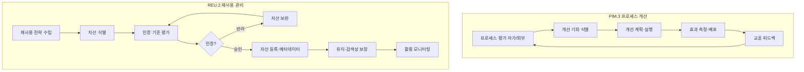

# 프로세스 개선 및 재사용 프로세스 (PRO-SPICE-01-11)

> 상위 정책: [[POL-SPICE-01_ASPICE역량거버넌스정책]]
> 적용요건: [[적용요건]] §1.9 (PIM.3, REU.2)
> 입력: business_flow.yaml SCN-021 (조직 차원 개선·재사용)

---

## 1. 목적

조직 표준 프로세스(SPP) 의 **지속적 개선(PIM.3)** 과 **재사용 가능한 작업 산출물(컴포넌트·라이브러리·문서 템플릿) 의 식별·인증·유지·검색 가능성 보장(REU.2)** 을 운영한다. POL-SPICE-01 의 §3 원칙 2 (Generic Practice 제도화) 를 실현하는 조직 차원 활동이다.

## 2. 적용 범위

VWAY Motors 의 모든 조직 표준 프로세스(11개 PRO + 하위 WI/TMP) 와 사내 재사용 자산(SW 컴포넌트·HW 모듈·ML 모델·문서 템플릿) 에 적용한다. 1회성 산출물·실험적 자산은 본 절차 대상이 아니다.

## 3. 역할과 책임 (RACI)

| 단계 | PQO Lead | Process Owner | Reuse Asset Owner | QA (SUP.1) | CTO |
|---|---|---|---|---|---|
| 프로세스 평가 (PIM.3.BP2) | **R** | C | I | C | A |
| 개선 기회 식별 (PIM.3.BP3) | **R** | **R** | I | C | I |
| 개선 실행·배포 (PIM.3.BP5) | **A** | **R** | I | C | I |
| 교훈 피드백 (PIM.3.BP6) | **R** | C | I | C | I |
| 재사용 전략 (REU.2.BP1) | **R** | C | C | I | A |
| 재사용 자산 등록·인증 (REU.2.BP3) | C | C | **R** | **A(QA)** | I |
| 자산 유지·검색성 (REU.2.BP4) | C | I | **R** | I | I |

## 4. 절차 흐름



## 5. 단계별 상세

| # | 단계 | ASPICE BP | 설명 | 입력 | 출력 |
|---|---|---|---|---|---|
| 1 | 프로세스 평가 | PIM.3.BP2 | PA 1.1~3.2 자가/외부 평가 | SPP, 평가 데이터 | Assessment Report |
| 2 | 개선 기회 식별 | PIM.3.BP3 | gap·교훈·고객 피드백 | Assessment | 개선 후보 |
| 3 | 개선 계획·실행 | PIM.3.BP4/5 | 개선안·배포 | 후보 | Improvement Plan + 배포 |
| 4 | 효과 측정 | PIM.3.BP5 | KPI 변화 측정 | 배포 후 | Effectiveness Report |
| 5 | 교훈 피드백 | PIM.3.BP6 | Lessons Learned | 개선 결과 | LL 데이터베이스 |
| 6 | 재사용 전략 | REU.2.BP1 | 도메인·자산 유형·정책 | 조직 전략 | Reuse Strategy |
| 7 | 자산 식별·등록 | REU.2.BP3 | 메타데이터·인터페이스 | 후보 자산 | Reuse Asset Register |
| 8 | 인증 평가 | REU.2.BP2 | 적합성 기준 평가 | 자산 + 기준 | Certification Record |
| 9 | 유지·검색성 | REU.2.BP4 | 갱신·검색 인터페이스 | 등록 자산 | 유지 기록 |

## 6. 연계 업무지침 (WI)

- [[WI-SPICE-01-11-01_프로세스평가]]
- [[WI-SPICE-01-11-02_개선기회식별및실행]]
- [[WI-SPICE-01-11-03_재사용전략수립]]
- [[WI-SPICE-01-11-04_재사용자산등록및인증]]
- [[WI-SPICE-01-11-05_재사용자산유지및검색성]]

## 7. 통제점 / KPI

| 통제점 | 지표 | 목표 | 주기 |
|---|---|---|---|
| 프로세스 평가 주기성 | 자가 평가 수행 | 분기 1회 | 분기 |
| 개선 종결율 | 식별→배포 종결 | ≥ 80% | 반기 |
| 개선 효과 측정 | KPI 개선 검증 | ≥ 70% 개선 | 반기 |
| 재사용 자산 활용도 | 신규 프로젝트 reuse 비율 | ≥ 30% | 반기 |
| 자산 검색성 | 평균 검색→활용 시간 | ≤ 30분 | 분기 |

## 8. 표준 매핑 (Traceability)

| ASPICE 조항 | Req-ID | 반영 |
|---|---|---|
| PIM.3 Purpose / BP3 | SPICE-PIM3-R-001/002 | §5 단계 1~5 |
| REU.2 Purpose / BP2 | SPICE-REU2-R-001/002 | §5 단계 6~9 |

## 9. 출처 (source_citation)

```yaml
- type: standard_original
  file: "inputs/01_표준원문/VWAY_Motors/requirements.yaml"
  locator: "VWAY-PIM.3-*, VWAY-REU.2-*"
  retrieved_at: "2026-05-06"
  license: "ASPICE 4.0 © VDA QMC — paraphrase only"
  paraphrase_only: true
- type: standard_original
  file: "inputs/06_목표흐름/business_flow.yaml"
  locator: "SCN-021"
  retrieved_at: "2026-05-06"
```

## 10. 개정 이력

| 버전 | 일자 | 변경내용 | 승인자 |
|---|---|---|---|
| 0.1 | 2026-05-06 | 최초 초안 — PIM.3 + REU.2 통합 정의 | (대기) |
