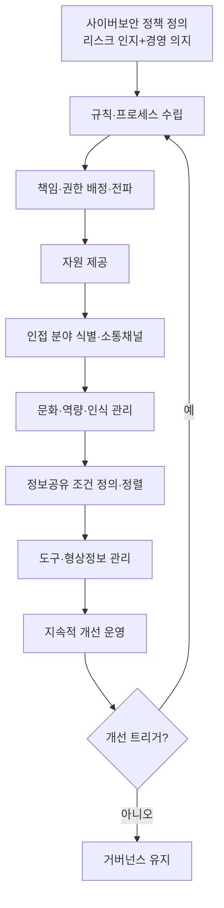

# 조직 사이버보안 거버넌스 운영 절차 (PRO-VCSMS-01-01)

> 상위 정책: [[POL-VCSMS-01_자동차_사이버보안_거버넌스_정책]] · 기준: [[표준프로세스_구성원칙]]

## 1. 목적
조직 차원의 사이버보안 거버넌스를 **정책 정의 → 규칙·프로세스 수립 → 책임·자원 배정 → 문화·역량 관리 → 정보공유·지속개선**의 통제된 흐름으로 운영하여, ISO/SAE 21434 Clause 5 의 조직 요구를 충족하고 프로젝트·지속활동의 기반을 제공한다.

## 2. 적용 범위
차량 E/E 사이버보안을 수행·지원하는 전사 조직에 적용한다. Clause 5.4.1(정책·규칙·책임·자원·통합·개선·정보공유), 5.4.2(문화·역량), 5.4.4–5.4.6(QMS·도구·정보보안 경계면 참조)을 다룬다. 독립 감사(§5.4.7)는 [[PRO-VCSMS-01-02_독립_조직_사이버보안_감사_절차]] 로 분리한다.

> **경계면 참조** — 변경·문서·형상·요구사항 관리는 상위 QMS(§5.4.4), 정보보안 관리는 ISMS(§5.4.6), 역량 관리는 상위 §7.2 를 참조한다. 본 절차에서 중복 생성하지 않는다 (MAT-07 Interface 대상).

## 3. 역할과 책임 (RACI)
| 단계 | 경영진 | CSM | Process Owner | 역할 담당자 |
|---|---|---|---|---|
| 정책·규칙 수립 | A | **R** | C | I |
| 책임·권한 배정 | **A** | R | C | I |
| 자원 제공 | **A** | R | I | I |
| 문화·역량·인식 관리 | I | **A** | R | C |
| 정보공유 조건 정의 | I | **A** | R | I |
| 도구·형상정보 관리 | I | A | **R** | C |
| 지속적 개선 운영 | I | **A** | R | C |

> Accountable 은 단계당 1명. 자원·책임 배정의 최종 책임은 경영진.

## 4. 절차 흐름


## 5. 단계별 상세
| # | 단계 | 설명 | 담당 | 입력 | 출력 |
|---|---|---|---|---|---|
| 1 | 정책 정의 | 리스크 인지·경영 의지 반영 정책 수립 | CSM/경영진 | 표준 요건, 조직 컨텍스트 | 사이버보안 정책 (WP-05-01) |
| 2 | 규칙 수립 | 활동 가능케 하는 규칙·프로세스 수립·유지 | CSM | 정책 | 규칙·프로세스 문서 |
| 3 | 책임 배정 | 책임·조직 권한 배정·전파 | 경영진 | 정책·규칙 | 책임 배정표 |
| 4 | 자원 제공 | 대응 자원 확보·할당 | 경영진 | 책임 배정 | 자원 계획 |
| 5 | 분야 통합 | 인접 분야 식별·소통채널 수립 | CSM | 조직 맵 | 소통채널 정의 |
| 6 | 문화·역량 | 문화 조성, 역량·인식 보장 (역량 → §7.2 참조) | CSM | 역할 정의 | 역량·인식 증거 (WP-05-02) |
| 7 | 정보공유 | 공유 요구/허용/금지 정의, 정보보안 정렬 | Process Owner | 정책 | 정보공유 규칙 |
| 8 | 도구·형상 | 사이버보안 영향 도구 관리, 형상정보 가용 유지 | Process Owner | 규칙 | 도구관리 증거 (WP-05-04) |
| 9 | 지속개선 | 개선 프로세스 운영, 트리거 시 갱신 | CSM | 운영 피드백 | 개선 기록 |

## 6. 연계 업무지침 (WI)
- [[WI-VCSMS-01-01-01_사이버보안_정책_규칙_프로세스_수립]]
- [[WI-VCSMS-01-01-02_책임_권한_배정_및_자원_제공]]
- [[WI-VCSMS-01-01-03_사이버보안_문화_역량_인식_관리]]
- [[WI-VCSMS-01-01-04_정보공유_조건_정의_및_소통채널_운영]]
- [[WI-VCSMS-01-01-05_도구_관리_및_형상정보_가용성_유지]]

## 7. 통제점 / KPI
| 통제점 | 지표 | 목표 | 주기 |
|---|---|---|---|
| 정책 검토 | 정책 유효성 검토 수행 | 연 1회 이상 | 연 |
| 역량 충족 | 사이버보안 역할 담당자 역량 충족율 | 100% | 반기 |
| 정보공유 준수 | 정보공유 규칙 위반 건수 | 0건 | 분기 |
| 도구 관리 | 미관리 사이버보안 영향 도구 | 0건 | 분기 |
| 개선 이행 | 개선 조치 완료율 | ≥ 90% | 분기 |

## 8. 표준 매핑 (Traceability)
| 표준 조항 | Req-ID (native) | 반영 위치 |
|---|---|---|
| §5.4.1 | VCSMS-R-001~005, 008 ([RQ-05-01~05,08]) | §5 단계 1~5, 9 |
| §5.4.2 | VCSMS-R-006, 007 ([RQ-05-06,07]) | §5 단계 6 |
| §5.4.3 | VCSMS-R-009, 010 ([RQ-05-09], [RC-05-10]) | §5 단계 7 |
| §5.4.4–5.4.6 | VCSMS-R-011~016 ([RQ/RC-05-11~16]) | §2 경계면 참조, §5 단계 8 |

## 9. 출처 (source_citation)
```yaml
- type: standard_original
  file: "inputs/01_표준원문/AutoCyberSec/requirements.yaml"
  locator: "ISO/SAE 21434:2021 §5.4.1–5.4.6 [RQ/RC-05-01~16]"
  retrieved_at: "2026-06-14"
  license: "ISO/SAE copyright"
  paraphrase_only: true
- type: business_flow
  file: "inputs/06_목표흐름/business_flow.yaml"
  locator: "SC-001, SC-002, SC-003"
  retrieved_at: "2026-06-14"
  license: "내부 자산"
```

## 10. 개정 이력
| 버전 | 일자 | 변경내용 | 승인자 |
|---|---|---|---|
| 0.1 | 2026-06-14 | 최초 초안 — Clause 5 거버넌스 운영 절차 | (미승인) |
