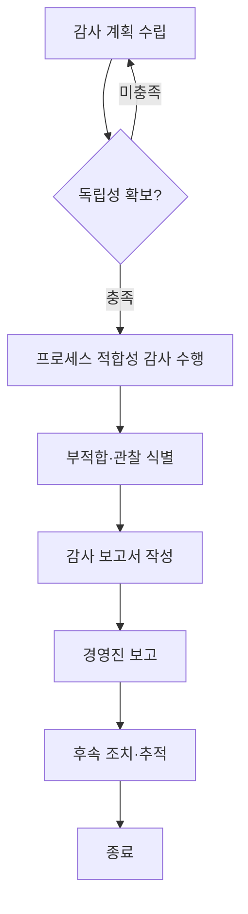

# 독립 조직 사이버보안 감사 절차 (PRO-VCSMS-01-02)

> 상위 정책: [[POL-VCSMS-01_자동차_사이버보안_거버넌스_정책]] · 기준: [[표준프로세스_구성원칙]]

## 1. 목적
조직의 사이버보안 프로세스가 ISO/SAE 21434 의 목적을 달성하는지를 **실행자와 독립된 주체**가 계획·수행·보고하여 객관적으로 판정한다.

## 2. 적용 범위
조직 차원 사이버보안 프로세스 전반(§5.4.7 [RQ-05-17])에 적용한다. 독립성 원칙(auditor ≠ executor)은 상위 내부심사(§9.2)와 정합한다. 프로젝트 차원의 사이버보안 평가(§6.4.8)는 [[PRO-VCSMS-02-02_사이버보안_케이스_평가_및_릴리스_절차]] 로 분리한다.

> **경계면 참조** — 내부심사 거버넌스(독립성·심사원 자격)는 상위 §9.2 를 참조한다 (MAT-07 Interface 대상).

## 3. 역할과 책임 (RACI)
| 단계 | 경영진 | CSM | 감사인(Auditor) | 피감 조직 |
|---|---|---|---|---|
| 감사 계획·독립성 확보 | A | C | **R** | I |
| 적합성 감사 수행 | I | I | **R/A** | C |
| 감사 보고 | **A** | C | R | I |
| 후속 조치 | I | **A** | C | R |

> 감사인은 피감 활동의 실행 책임이 없어야 한다 (독립성).

## 4. 절차 흐름


## 5. 단계별 상세
| # | 단계 | 설명 | 담당 | 입력 | 출력 |
|---|---|---|---|---|---|
| 1 | 감사 계획 | 범위·기준·일정·심사원 선정(독립성) | 감사인 | 거버넌스 산출물 | 감사 계획 |
| 2 | 독립성 확인 | auditor ≠ executor 검증 | CSM | 심사원 이력 | 독립성 확인 |
| 3 | 감사 수행 | 프로세스 적합성 점검·증거 수집 | 감사인 | WP-05 산출물 | 감사 발견사항 |
| 4 | 보고 | 적합성 판정·부적합·관찰 보고 | 감사인 | 발견사항 | 감사 보고서 (WP-05-05) |
| 5 | 후속 조치 | 시정조치 계획·추적·종결 | Process Owner | 감사 보고서 | 조치 기록 |

## 6. 연계 업무지침 (WI)
- [[WI-VCSMS-01-02-01_사이버보안_감사_계획_및_독립성_확보]]
- [[WI-VCSMS-01-02-02_조직_프로세스_적합성_감사_수행]]
- [[WI-VCSMS-01-02-03_조직_사이버보안_감사_보고_및_후속조치]]

## 7. 통제점 / KPI
| 통제점 | 지표 | 목표 | 주기 |
|---|---|---|---|
| 감사 주기 | 조직 사이버보안 감사 수행 | 연 1회 이상 | 연 |
| 독립성 | 독립성 위반(auditor=executor) | 0건 | 감사 시 |
| 부적합 종결 | 시정조치 완료율 | ≥ 95% | 분기 |
| 보고 적시성 | 감사 종료→보고 리드타임 | ≤ 10 영업일 | 감사 시 |

## 8. 표준 매핑 (Traceability)
| 표준 조항 | Req-ID (native) | 반영 위치 |
|---|---|---|
| §5.4.7 | VCSMS-R-017 ([RQ-05-17]) | §4 흐름 전체, §5 단계 1~5 |

## 9. 출처 (source_citation)
```yaml
- type: standard_original
  file: "inputs/01_표준원문/AutoCyberSec/requirements.yaml"
  locator: "ISO/SAE 21434:2021 §5.4.7 [RQ-05-17], WP §5.5 [WP-05-05]"
  retrieved_at: "2026-06-14"
  license: "ISO/SAE copyright"
  paraphrase_only: true
- type: business_flow
  file: "inputs/06_목표흐름/business_flow.yaml"
  locator: "SC-004"
  retrieved_at: "2026-06-14"
  license: "내부 자산"
```

## 10. 개정 이력
| 버전 | 일자 | 변경내용 | 승인자 |
|---|---|---|---|
| 0.1 | 2026-06-14 | 최초 초안 — §5.4.7 독립 조직 사이버보안 감사 절차 | (미승인) |
