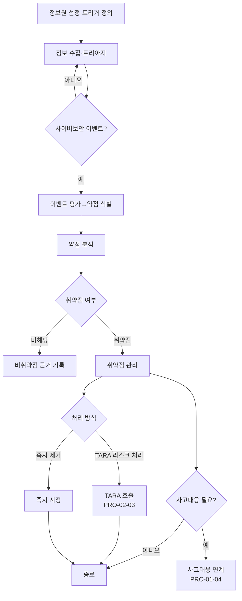

# 지속적 사이버보안 활동 및 취약점 관리 절차 (PRO-VCSMS-01-03)

> 상위 정책: [[POL-VCSMS-01_자동차_사이버보안_거버넌스_정책]] · 기준: [[표준프로세스_구성원칙]]

## 1. 목적
양산·운영 중 차량의 사이버보안 정보를 **수집 → 트리아지 → 이벤트 평가 → 약점·취약점 분석 → 처리**의 상시 흐름으로 관리하여, 신규 위협·취약점에 적시 대응하고 잔존 리스크를 통제한다.

## 2. 적용 범위
운영 중 item/component 에 대한 지속적 사이버보안 활동(Clause 8.3–8.6)에 적용한다. 취약점의 리스크 처리는 TARA(§15.9, [[PRO-VCSMS-02-03_위협분석_및_리스크평가_TARA_절차]])를 호출하며, 사고 대응이 필요하면 [[PRO-VCSMS-01-04_사이버보안_사고_대응_절차]]를 연계한다.

## 3. 역할과 책임 (RACI)
| 단계 | CSM | 모니터링 담당 | 보안 분석가 | Project CS Lead |
|---|---|---|---|---|
| 정보원·트리거 정의 | A | **R** | C | I |
| 수집·트리아지·이벤트 판별 | I | **R** | C | I |
| 이벤트 평가·약점 식별 | A | C | **R** | C |
| 약점 분석·취약점 식별 | A | I | **R** | C |
| 취약점 관리·처리 결정 | **A** | I | R | C |

## 4. 절차 흐름


## 5. 단계별 상세
| # | 단계 | 설명 | 담당 | 입력 | 출력 |
|---|---|---|---|---|---|
| 1 | 정보원·트리거 | 정보원 선정, 트리아지 트리거 정의·유지 | 모니터링 담당 | 위협 인텔 소스 | 정보원·트리거 (WP-08-01,02) |
| 2 | 수집·트리아지 | 수집·트리아지로 이벤트 발생 판별 | 모니터링 담당 | 수집 정보 | 이벤트 후보 (WP-08-03) |
| 3 | 이벤트 평가 | item/component 약점 식별 | 보안 분석가 | 이벤트 | 약점 (WP-08-04) |
| 4 | 약점 분석 | 취약점 식별, 비취약점 근거 제시 | 보안 분석가 | 약점 | 취약점 분석 (WP-08-05) |
| 5 | 취약점 관리 | §15.9 리스크 처리 또는 즉시 제거 | CSM/분석가 | 취약점 | 관리 증거 (WP-08-06) |
| 6 | 사고 연계 | 사고대응 요할 시 §13.3 적용 | CSM | 처리 결정 | 사고 연계 |

## 6. 연계 업무지침 (WI)
- [[WI-VCSMS-01-03-01_정보원_선정_및_트리아지_트리거_정의]]
- [[WI-VCSMS-01-03-02_정보_수집_트리아지_및_이벤트_판별]]
- [[WI-VCSMS-01-03-03_사이버보안_이벤트_평가_및_약점_식별]]
- [[WI-VCSMS-01-03-04_약점_분석_및_취약점_식별]]
- [[WI-VCSMS-01-03-05_취약점_관리_및_처리_결정]]

## 7. 통제점 / KPI
| 통제점 | 지표 | 목표 | 주기 |
|---|---|---|---|
| 모니터링 커버리지 | 선정 정보원 활성률 | 100% | 월 |
| 트리아지 적시성 | 정보 접수→트리아지 | ≤ 정의 SLA | 월 |
| 취약점 처리 | 취약점 처리 완료율 | ≥ 95% | 분기 |
| 비취약점 근거 | 근거 누락 약점 | 0건 | 분기 |

## 8. 표준 매핑 (Traceability)
| 표준 조항 | Req-ID (native) | 반영 위치 |
|---|---|---|
| §8.3 | VCSMS-R-060~062 ([RQ-08-01~03]) | §5 단계 1~2 |
| §8.4 | VCSMS-R-063 ([RQ-08-04]) | §5 단계 3 |
| §8.5 | VCSMS-R-064, 065 ([RQ-08-05,06]) | §5 단계 4 |
| §8.6 | VCSMS-R-066, 067 ([RQ-08-07,08]) | §5 단계 5~6 |

## 9. 출처 (source_citation)
```yaml
- type: standard_original
  file: "inputs/01_표준원문/AutoCyberSec/requirements.yaml"
  locator: "ISO/SAE 21434:2021 §8.3–8.6 [RQ-08-01~08]"
  retrieved_at: "2026-06-14"
  license: "ISO/SAE copyright"
  paraphrase_only: true
- type: business_flow
  file: "inputs/06_목표흐름/business_flow.yaml"
  locator: "SC-014"
  retrieved_at: "2026-06-14"
  license: "내부 자산"
```

## 10. 개정 이력
| 버전 | 일자 | 변경내용 | 승인자 |
|---|---|---|---|
| 0.1 | 2026-06-14 | 최초 초안 — Clause 8 지속적 활동·취약점 관리 절차 | (미승인) |
