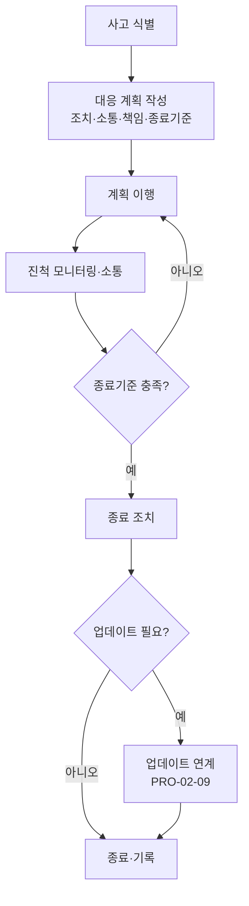

# 사이버보안 사고 대응 절차 (PRO-VCSMS-01-04)

> 상위 정책: [[POL-VCSMS-01_자동차_사이버보안_거버넌스_정책]] · 기준: [[표준프로세스_구성원칙]]

## 1. 목적
사이버보안 사고를 **대응 계획 작성 → 이행 → 진척 모니터링 → 종료**의 통제된 흐름으로 처리하여, 피해를 억제하고 잔존 리스크를 종료기준에 따라 해소한다.

## 2. 적용 범위
운영 중 식별된 사이버보안 사고(§13.3)에 적용한다. 취약점 관리([[PRO-VCSMS-01-03_지속적_사이버보안_활동_및_취약점_관리_절차]])에서 사고 대응이 필요하다고 판단된 경우 호출된다. 사고 결과 업데이트가 필요하면 [[PRO-VCSMS-02-09_운영_업데이트_및_지원종료_폐기_절차]]를 연계한다.

## 3. 역할과 책임 (RACI)
| 단계 | CSM | 사고대응 팀장 | 대응 인력 | 소통 담당 |
|---|---|---|---|---|
| 대응 계획 작성 | A | **R** | C | C |
| 계획 이행 | I | **A** | R | C |
| 진척 모니터링 | A | **R** | C | I |
| 소통·통보 | I | A | I | **R** |
| 종료·후속 | **A** | R | C | I |

## 4. 절차 흐름


## 5. 단계별 상세
| # | 단계 | 설명 | 담당 | 입력 | 출력 |
|---|---|---|---|---|---|
| 1 | 계획 작성 | 조치·소통·책임·기록·진척·종료기준·종료조치 정의 | 사고대응 팀장 | 사고 정보 | 대응 계획 (WP-13-01) |
| 2 | 이행 | 계획에 따른 대응 실행 | 대응 인력 | 대응 계획 | 조치 기록 |
| 3 | 모니터링 | 진척 추적·이해관계자 소통 | 팀장/소통 담당 | 조치 기록 | 진척 보고 |
| 4 | 종료 | 종료기준 충족 확인·종료조치 | CSM | 진척 보고 | 종료 기록 |
| 5 | 후속 | 업데이트·재발방지 연계 | CSM | 종료 기록 | 후속 조치 |

## 6. 연계 업무지침 (WI)
- [[WI-VCSMS-01-04-01_사고_대응_계획_작성]]
- [[WI-VCSMS-01-04-02_사고_대응_계획_이행_및_진척_모니터링]]
- [[WI-VCSMS-01-04-03_사고_종료_및_후속_조치]]

## 7. 통제점 / KPI
| 통제점 | 지표 | 목표 | 주기 |
|---|---|---|---|
| 대응 착수 | 사고 인지→계획 착수 | ≤ 정의 SLA | 사고 시 |
| 종료기준 준수 | 종료기준 미충족 종결 | 0건 | 사고 시 |
| 소통 적시성 | 통보 의무 이행율 | 100% | 사고 시 |
| 재발 | 동일 원인 재발 건수 | 감소 추세 | 분기 |

## 8. 표준 매핑 (Traceability)
| 표준 조항 | Req-ID (native) | 반영 위치 |
|---|---|---|
| §13.3 | VCSMS-R-097 ([RQ-13-01]) | §5 단계 1 |
| §13.3 | VCSMS-R-098 ([RQ-13-02]) | §5 단계 2~4 |

## 9. 출처 (source_citation)
```yaml
- type: standard_original
  file: "inputs/01_표준원문/AutoCyberSec/requirements.yaml"
  locator: "ISO/SAE 21434:2021 §13.3 [RQ-13-01,02]"
  retrieved_at: "2026-06-14"
  license: "ISO/SAE copyright"
  paraphrase_only: true
- type: business_flow
  file: "inputs/06_목표흐름/business_flow.yaml"
  locator: "SC-015"
  retrieved_at: "2026-06-14"
  license: "내부 자산"
```

## 10. 개정 이력
| 버전 | 일자 | 변경내용 | 승인자 |
|---|---|---|---|
| 0.1 | 2026-06-14 | 최초 초안 — §13.3 사이버보안 사고 대응 절차 | (미승인) |
