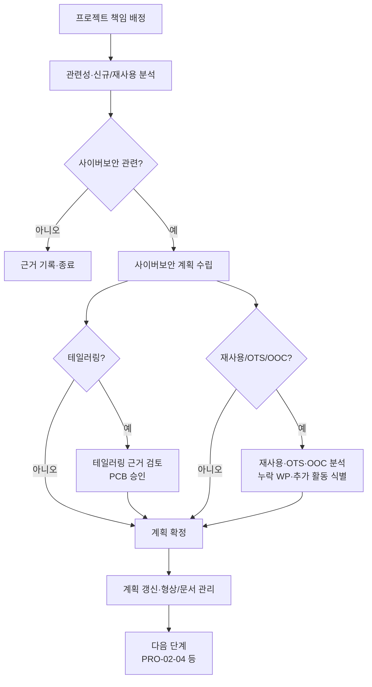

# 프로젝트 사이버보안 관리 절차 (PRO-VCSMS-02-01)

> 상위 정책: [[POL-VCSMS-02_차량_사이버보안_엔지니어링_정책]] · 기준: [[표준프로세스_구성원칙]]

## 1. 목적
프로젝트별 사이버보안 활동을 **책임 배정 → 관련성·재사용 분석 → 계획 수립 → 테일러링 → 계획 유지**의 흐름으로 관리하여, 컨셉·개발·검증 활동(Clause 9·10·11·15)이 일관·추적 가능하게 수행되도록 한다.

## 2. 적용 범위
사이버보안 관련성이 검토되는 모든 개발·사후개발 프로젝트(§6.4.1–6.4.6)에 적용한다. 재사용·OTS·out-of-context 컴포넌트 분석을 포함한다. 케이스·평가·릴리스는 [[PRO-VCSMS-02-02_사이버보안_케이스_평가_및_릴리스_절차]] 로 이어진다.

> **경계면 참조** — 계획·작업산출물의 형상·변경·요구사항·문서 관리는 상위 QMS(§5.4.4)를 참조한다 (MAT-07 Interface 대상).

## 3. 역할과 책임 (RACI)
| 단계 | CSM | Project CS Lead | 개발팀 | PCB |
|---|---|---|---|---|
| 책임 배정 | **A** | R | I | I |
| 관련성·재사용 분석 | C | **R/A** | C | I |
| 계획 수립 | **A** | R | C | I |
| 테일러링·근거 검토 | C | R | I | **A** |
| 재사용·OTS·OOC 분석 | C | **R/A** | C | I |
| 계획 갱신·형상관리 | I | **R/A** | C | I |

## 4. 절차 흐름


## 5. 단계별 상세
| # | 단계 | 설명 | 담당 | 입력 | 출력 |
|---|---|---|---|---|---|
| 1 | 책임 배정 | 프로젝트 사이버보안 책임·권한 배정·전파 | CSM | 조직 책임 | 책임 배정표 |
| 2 | 관련성 분석 | 관련성·신규/재사용·테일러링 적용 결정 | Project CS Lead | item/component 정보 | 관련성 판정 |
| 3 | 계획 수립 | 목표·의존성·담당·자원·기간·산출물 계획 | Project CS Lead | 관련성 판정 | 사이버보안 계획 (WP-06-01) |
| 4 | 테일러링 | 적정·충분성 근거 제시·검토 (리스크값 1 등) | Project CS Lead/PCB | 계획 | 테일러링 근거 |
| 5 | 재사용/OTS/OOC | 변경·영향·누락 WP·가정 검증·충족성 분석 | Project CS Lead | 컴포넌트 문서 | 재사용·OTS·OOC 분석 |
| 6 | 계획 유지 | 변경·정련 식별 시 갱신, 형상/문서 관리 | Project CS Lead | 활동 변경 | 갱신 계획 |

## 6. 연계 업무지침 (WI)
- [[WI-VCSMS-02-01-01_프로젝트_사이버보안_책임_배정]]
- [[WI-VCSMS-02-01-02_사이버보안_관련성_신규_재사용_분석]]
- [[WI-VCSMS-02-01-03_사이버보안_계획_수립]]
- [[WI-VCSMS-02-01-04_사이버보안_활동_테일러링_및_근거_검토]]
- [[WI-VCSMS-02-01-05_재사용_OTS_OOC_컴포넌트_분석]]
- [[WI-VCSMS-02-01-06_계획_갱신_및_형상_문서_관리]]

## 7. 통제점 / KPI
| 통제점 | 지표 | 목표 | 주기 |
|---|---|---|---|
| 계획 수립 | 관련 프로젝트 계획 보유율 | 100% | 프로젝트 |
| 테일러링 근거 | 근거 없는 테일러링 | 0건 | 프로젝트 |
| 재사용 분석 | 재사용 컴포넌트 분석 완료율 | 100% | 프로젝트 |
| 계획 최신성 | 미갱신 계획(변경 후) | 0건 | 월 |

## 8. 표준 매핑 (Traceability)
| 표준 조항 | Req-ID (native) | 반영 위치 |
|---|---|---|
| §6.4.1 | VCSMS-R-018 ([RQ-06-01]) | §5 단계 1 |
| §6.4.2 | VCSMS-R-019~029 ([RQ/PM-06-02~12]) | §5 단계 2~3, 6 |
| §6.4.3 | VCSMS-R-030, 031 ([PM-06-13], [RQ-06-14]) | §5 단계 4 |
| §6.4.4 | VCSMS-R-032~034 ([RQ-06-15~17]) | §5 단계 5 |
| §6.4.5 | VCSMS-R-035~037 ([RQ-06-18~20]) | §5 단계 5 |
| §6.4.6 | VCSMS-R-038, 039 ([RQ-06-21,22]) | §5 단계 5 |

## 9. 출처 (source_citation)
```yaml
- type: standard_original
  file: "inputs/01_표준원문/AutoCyberSec/requirements.yaml"
  locator: "ISO/SAE 21434:2021 §6.4.1–6.4.6 [RQ/PM-06-01~22]"
  retrieved_at: "2026-06-14"
  license: "ISO/SAE copyright"
  paraphrase_only: true
- type: business_flow
  file: "inputs/06_목표흐름/business_flow.yaml"
  locator: "SC-005, SC-006"
  retrieved_at: "2026-06-14"
  license: "내부 자산"
```

## 10. 개정 이력
| 버전 | 일자 | 변경내용 | 승인자 |
|---|---|---|---|
| 0.1 | 2026-06-14 | 최초 초안 — §6.4.1–6.4.6 프로젝트 사이버보안 관리 절차 | (미승인) |
