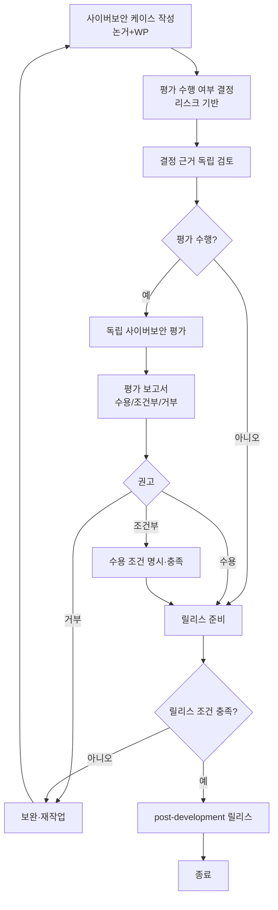

# 사이버보안 케이스·평가 및 릴리스 절차 (PRO-VCSMS-02-02)

> 상위 정책: [[POL-VCSMS-02_차량_사이버보안_엔지니어링_정책]] · 기준: [[표준프로세스_구성원칙]]

## 1. 목적
프로젝트 산출물을 **사이버보안 케이스로 논증 → (리스크 기반) 독립 평가 → 권고 → post-development 릴리스**의 게이트로 통제하여, 릴리스 조건을 충족한 item/component 만 출시되도록 한다.

## 2. 적용 범위
사이버보안 케이스(§6.4.7), 사이버보안 평가(§6.4.8), post-development 릴리스(§6.4.9)에 적용한다. 케이스는 개발·검증([[PRO-VCSMS-02-05_제품개발_사이버보안_엔지니어링_절차]], [[PRO-VCSMS-02-06_차량_수준_사이버보안_검증_절차]])의 작업산출물로 뒷받침된다.

> **경계면 참조** — 평가 독립성 거버넌스는 조직 감사(§5.4.7)·상위 §9.2 와 정합한다 (MAT-07 Interface 대상).

## 3. 역할과 책임 (RACI)
| 단계 | CSM | Project CS Lead | Assessor(독립) | 경영진 |
|---|---|---|---|---|
| 케이스 작성 | A | **R** | I | I |
| 평가 수행 여부 결정 | **A** | R | C | I |
| 독립 검토(결정 근거) | C | I | **R** | I |
| 독립 평가 수행 | I | C | **R/A** | I |
| 평가 보고·권고 | C | I | **R** | I |
| 릴리스 결정 | C | R | C | **A** |

## 4. 절차 흐름


## 5. 단계별 상세
| # | 단계 | 설명 | 담당 | 입력 | 출력 |
|---|---|---|---|---|---|
| 1 | 케이스 작성 | 작업산출물로 뒷받침되는 논거 작성 | Project CS Lead | WP 일체 | 사이버보안 케이스 (WP-06-02) |
| 2 | 평가 결정 | 리스크 기반 평가 수행 여부 결정 | CSM | 케이스·리스크값 | 평가 결정 |
| 3 | 독립 검토 | 결정 근거 독립 검토 | Assessor | 평가 결정 | 검토 의견 |
| 4 | 독립 평가 | 계획·WP·리스크 처리·통제 적정성·근거 평가 | Assessor | 케이스 | 평가 수행 |
| 5 | 평가 보고 | 수용/조건부/거부 권고, 조건 명시 | Assessor | 평가 결과 | 평가 보고서 (WP-06-03) |
| 6 | 릴리스 | 케이스·평가·post-dev 요구 충족 후 릴리스 | 경영진/CSM | 보고서 | 릴리스 보고서 (WP-06-04) |

## 6. 연계 업무지침 (WI)
- [[WI-VCSMS-02-02-01_사이버보안_케이스_작성]]
- [[WI-VCSMS-02-02-02_평가_수행_여부_결정_및_독립_검토]]
- [[WI-VCSMS-02-02-03_독립_사이버보안_평가_수행]]
- [[WI-VCSMS-02-02-04_평가_보고서_작성]]
- [[WI-VCSMS-02-02-05_post_development_릴리스]]

## 7. 통제점 / KPI
| 통제점 | 지표 | 목표 | 주기 |
|---|---|---|---|
| 케이스 완비 | 릴리스 전 케이스 완성율 | 100% | 프로젝트 |
| 평가 독립성 | 독립성 위반 평가 | 0건 | 프로젝트 |
| 릴리스 게이트 | 조건 미충족 릴리스 | 0건 | 프로젝트 |
| 조건부 종결 | 조건부 수용 조건 종결율 | 100% | 프로젝트 |

## 8. 표준 매핑 (Traceability)
| 표준 조항 | Req-ID (native) | 반영 위치 |
|---|---|---|
| §6.4.7 | VCSMS-R-040 ([RQ-06-23]) | §5 단계 1 |
| §6.4.8 | VCSMS-R-041~049 ([RQ/PM-06-24~32]) | §5 단계 2~5 |
| §6.4.9 | VCSMS-R-050, 051 ([RQ-06-33,34]) | §5 단계 6 |

## 9. 출처 (source_citation)
```yaml
- type: standard_original
  file: "inputs/01_표준원문/AutoCyberSec/requirements.yaml"
  locator: "ISO/SAE 21434:2021 §6.4.7–6.4.9 [RQ/PM-06-23~34]"
  retrieved_at: "2026-06-14"
  license: "ISO/SAE copyright"
  paraphrase_only: true
- type: business_flow
  file: "inputs/06_목표흐름/business_flow.yaml"
  locator: "SC-007"
  retrieved_at: "2026-06-14"
  license: "내부 자산"
```

## 10. 개정 이력
| 버전 | 일자 | 변경내용 | 승인자 |
|---|---|---|---|
| 0.1 | 2026-06-14 | 최초 초안 — §6.4.7–6.4.9 케이스·평가·릴리스 절차 | (미승인) |
