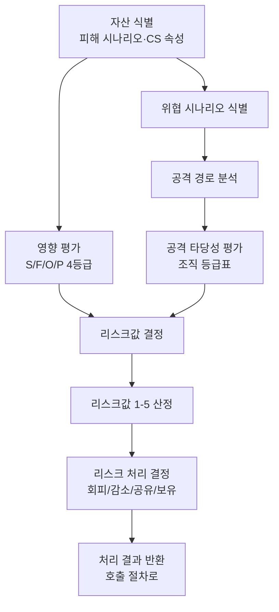

# 위협분석 및 리스크평가(TARA) 절차 (PRO-VCSMS-02-03)

> 상위 정책: [[POL-VCSMS-02_차량_사이버보안_엔지니어링_정책]] · 기준: [[표준프로세스_구성원칙]]
> **횡단 방법론** — 컨셉(§9.4)·취약점 관리(§8.6) 등에서 호출된다.

## 1. 목적
위협분석·리스크평가(TARA)를 **자산 식별 → 위협 시나리오 → 영향 평가 → 공격 경로 → 공격 타당성 → 리스크값 → 리스크 처리**의 표준화된 방법으로 수행하여, 사이버보안 활동의 리스크 기반 우선순위와 처리 결정을 제공한다.

## 2. 적용 범위
ISO/SAE 21434 Clause 15(§15.3–15.9)의 TARA 방법론에 적용한다. 컨셉([[PRO-VCSMS-02-04_컨셉_단계_사이버보안_엔지니어링_절차]] §9.4 [RQ-09-03])과 지속활동([[PRO-VCSMS-01-03_지속적_사이버보안_활동_및_취약점_관리_절차]] §8.6)에서 호출되는 재사용 절차다.

> **저작권 주의** — §15.7 Table 1(공격 타당성 등급) 원문 표는 산출물에 직접 전재하지 않는다. WI 단계에서 조직 자체 등급표로 재구성한다.

## 3. 역할과 책임 (RACI)
| 단계 | CSM | TARA 분석가 | 보안 설계자 | 안전 담당 |
|---|---|---|---|---|
| 자산 식별 | A | **R** | C | C |
| 위협 시나리오 | A | **R** | C | I |
| 영향 평가(S/F/O/P) | A | **R** | C | C(안전) |
| 공격 경로 분석 | I | **R** | C | I |
| 공격 타당성 | I | **R/A** | C | I |
| 리스크값 결정 | **A** | R | C | I |
| 리스크 처리 결정 | **A** | R | C | C |

## 4. 절차 흐름


## 5. 단계별 상세
| # | 단계 | 설명 | 담당 | 입력 | 출력 |
|---|---|---|---|---|---|
| 1 | 자산 식별 | 피해 시나리오·손상 시 피해로 이어지는 CS 속성 자산 | TARA 분석가 | 아이템 정의 | 피해 시나리오·자산 (WP-15-01,02) |
| 2 | 위협 시나리오 | 대상자산·손상속성·손상원인 위협 시나리오 | TARA 분석가 | 자산 | 위협 시나리오 (WP-15-03) |
| 3 | 영향 평가 | S/F/O/P 범주별 severe~negligible 판정 (안전은 ISO 26262 참조) | TARA 분석가 | 피해 시나리오 | 영향등급 (WP-15-04) |
| 4 | 공격 경로 | 위협 시나리오 분석으로 경로 식별·연계 | TARA 분석가 | 위협 시나리오 | 공격 경로 (WP-15-05) |
| 5 | 공격 타당성 | 조직 등급표(공격잠재력/CVSS/공격벡터)로 등급 결정 | TARA 분석가 | 공격 경로 | 공격 타당성 (WP-15-06) |
| 6 | 리스크값 | 영향×타당성으로 1~5 산정 | TARA 분석가 | 영향·타당성 | 리스크값 (WP-15-07) |
| 7 | 리스크 처리 | 회피/감소/공유/보유 결정 | CSM/분석가 | 리스크값 | 처리 결정 (WP-15-08) |

> §15.5 [PM-15-07]: 타 범주가 덜 치명적임을 논증 시 해당 범주 추가 분석 생략 가능(허용) — 단계 3 결정 포인트.

## 6. 연계 업무지침 (WI)
- [[WI-VCSMS-02-03-01_자산_식별]]
- [[WI-VCSMS-02-03-02_위협_시나리오_식별]]
- [[WI-VCSMS-02-03-03_영향_평가_SFOP]]
- [[WI-VCSMS-02-03-04_공격_경로_분석]]
- [[WI-VCSMS-02-03-05_공격_타당성_평가]]
- [[WI-VCSMS-02-03-06_리스크값_결정]]
- [[WI-VCSMS-02-03-07_리스크_처리_결정]]

## 7. 통제점 / KPI
| 통제점 | 지표 | 목표 | 주기 |
|---|---|---|---|
| TARA 완비 | 관련 item TARA 수행율 | 100% | 프로젝트 |
| 영향 일관성 | 안전 영향등급 ISO 26262 정합율 | 100% | 프로젝트 |
| 등급표 사용 | 자체 등급표 외 임의 판정 | 0건 | 프로젝트 |
| 처리 결정 | 리스크값 대비 미처리 건수 | 0건 | 프로젝트 |

## 8. 표준 매핑 (Traceability)
| 표준 조항 | Req-ID (native) | 반영 위치 |
|---|---|---|
| §15.3 | VCSMS-R-102, 103 ([RQ-15-01,02]) | §5 단계 1 |
| §15.4 | VCSMS-R-104 ([RQ-15-03]) | §5 단계 2 |
| §15.5 | VCSMS-R-105~108 ([RQ/PM-15-04~07]) | §5 단계 3 |
| §15.6 | VCSMS-R-109, 110 ([RQ-15-08,09]) | §5 단계 4 |
| §15.7 | VCSMS-R-111~115 ([RQ/RC-15-10~14]) | §5 단계 5 |
| §15.8 | VCSMS-R-116, 117 ([RQ-15-15,16]) | §5 단계 6 |
| §15.9 | VCSMS-R-118 ([RQ-15-17]) | §5 단계 7 |

## 9. 출처 (source_citation)
```yaml
- type: standard_original
  file: "inputs/01_표준원문/AutoCyberSec/requirements.yaml"
  locator: "ISO/SAE 21434:2021 §15.3–15.9 [RQ/RC/PM-15-01~17] (Table 1 §15.7 — 재구성)"
  retrieved_at: "2026-06-14"
  license: "ISO/SAE copyright"
  paraphrase_only: true
- type: standard_original
  file: "vault/09_REF_참고자료/REF-003_ISO26262_기능안전_경계면_v0.1.md"
  locator: "ISO 26262-3:2018 §6.4.3 안전 영향등급 도출"
  retrieved_at: "2026-06-14"
  license: "ISO copyright"
  paraphrase_only: true
- type: business_flow
  file: "inputs/06_목표흐름/business_flow.yaml"
  locator: "SC-008"
  retrieved_at: "2026-06-14"
  license: "내부 자산"
```

## 10. 개정 이력
| 버전 | 일자 | 변경내용 | 승인자 |
|---|---|---|---|
| 0.1 | 2026-06-14 | 최초 초안 — Clause 15 TARA 횡단 방법론 절차 | (미승인) |
