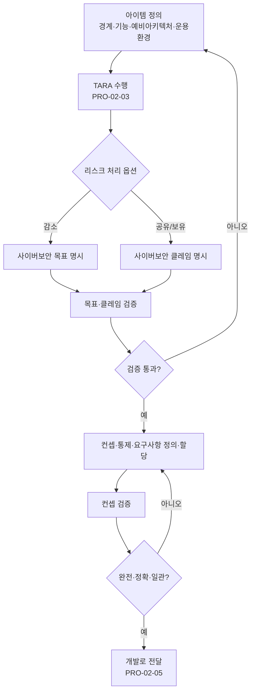

# 컨셉 단계 사이버보안 엔지니어링 절차 (PRO-VCSMS-02-04)

> 상위 정책: [[POL-VCSMS-02_차량_사이버보안_엔지니어링_정책]] · 기준: [[표준프로세스_구성원칙]]

## 1. 목적
컨셉 단계에서 **아이템 정의 → TARA → 목표·클레임 → 컨셉·요구사항**을 도출·검증하여, 후속 제품개발(Clause 10)에 전달할 사이버보안 요구의 완전·정확·일관성을 확보한다.

## 2. 적용 범위
ISO/SAE 21434 Clause 9(§9.3–9.5)에 적용한다. TARA([[PRO-VCSMS-02-03_위협분석_및_리스크평가_TARA_절차]])를 §9.4 [RQ-09-03] 에서 호출하며, 결과 요구는 [[PRO-VCSMS-02-05_제품개발_사이버보안_엔지니어링_절차]] 로 전달한다.

## 3. 역할과 책임 (RACI)
| 단계 | CSM | Project CS Lead | 보안 설계자 | TARA 분석가 |
|---|---|---|---|---|
| 아이템 정의 | A | **R** | C | C |
| TARA 수행 | A | C | C | **R** |
| 목표·클레임 도출 | A | **R** | C | C |
| 목표·클레임 검증 | **A** | R | C | I |
| 컨셉·요구 정의·할당 | C | R | **R** | C |
| 컨셉 검증 | **A** | R | C | I |

## 4. 절차 흐름


## 5. 단계별 상세
| # | 단계 | 설명 | 담당 | 입력 | 출력 |
|---|---|---|---|---|---|
| 1 | 아이템 정의 | 경계·기능·예비 아키텍처·운용환경 기술 | Project CS Lead | 컨셉 입력 | 아이템 정의 (WP-09-01) |
| 2 | TARA | 전 단계 수행, 처리 옵션 결정 | TARA 분석가 | 아이템 정의 | TARA (WP-09-02) |
| 3 | 목표·클레임 | 감소→목표, 공유/보유→클레임 명시 | Project CS Lead | 처리 옵션 | 목표·클레임 (WP-09-03,04) |
| 4 | 목표 검증 | 정확·완전·일관성 검증 | Project CS Lead | 목표·클레임 | 검증보고 (WP-09-05) |
| 5 | 컨셉 정의 | 통제·상호작용·요구 정의·아이템/컴포넌트 할당 | 보안 설계자 | 목표 | 컨셉·요구 (WP-09-06) |
| 6 | 컨셉 검증 | 통제·요구·할당의 목표/클레임 대비 검증 | Project CS Lead | 컨셉 | 컨셉 검증보고 (WP-09-07) |

## 6. 연계 업무지침 (WI)
- [[WI-VCSMS-02-04-01_아이템_정의]]
- [[WI-VCSMS-02-04-02_TARA_수행_호출_및_처리_옵션_결정]]
- [[WI-VCSMS-02-04-03_사이버보안_목표_클레임_도출]]
- [[WI-VCSMS-02-04-04_목표_클레임_검증]]
- [[WI-VCSMS-02-04-05_사이버보안_컨셉_요구사항_정의_및_할당]]
- [[WI-VCSMS-02-04-06_컨셉_검증]]

## 7. 통제점 / KPI
| 통제점 | 지표 | 목표 | 주기 |
|---|---|---|---|
| 아이템 정의 완비 | 정의 누락 항목 | 0건 | 프로젝트 |
| TARO 연계 | 처리 결정→목표/클레임 매핑율 | 100% | 프로젝트 |
| 목표 검증 | 검증 미통과 잔존 | 0건 | 프로젝트 |
| 컨셉 추적성 | 요구↔목표 추적성 충족율 | 100% | 프로젝트 |

## 8. 표준 매핑 (Traceability)
| 표준 조항 | Req-ID (native) | 반영 위치 |
|---|---|---|
| §9.3 | VCSMS-R-068, 069 ([RQ-09-01,02]) | §5 단계 1 |
| §9.4 | VCSMS-R-070~074 ([RQ-09-03~07]) | §5 단계 2~4 |
| §9.5 | VCSMS-R-075~078 ([RQ-09-08~11]) | §5 단계 5~6 |

## 9. 출처 (source_citation)
```yaml
- type: standard_original
  file: "inputs/01_표준원문/AutoCyberSec/requirements.yaml"
  locator: "ISO/SAE 21434:2021 §9.3–9.5 [RQ-09-01~11]"
  retrieved_at: "2026-06-14"
  license: "ISO/SAE copyright"
  paraphrase_only: true
- type: business_flow
  file: "inputs/06_목표흐름/business_flow.yaml"
  locator: "SC-009"
  retrieved_at: "2026-06-14"
  license: "내부 자산"
```

## 10. 개정 이력
| 버전 | 일자 | 변경내용 | 승인자 |
|---|---|---|---|
| 0.1 | 2026-06-14 | 최초 초안 — Clause 9 컨셉 단계 사이버보안 엔지니어링 절차 | (미승인) |
