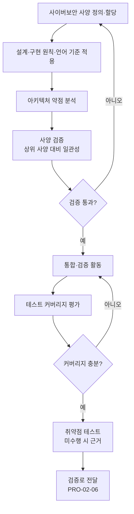

# 제품개발 사이버보안 엔지니어링 절차 (PRO-VCSMS-02-05)

> 상위 정책: [[POL-VCSMS-02_차량_사이버보안_엔지니어링_정책]] · 기준: [[표준프로세스_구성원칙]]

## 1. 목적
컨셉의 사이버보안 요구를 **사양 정의 → 설계·구현 → 약점 분석 → 사양 검증 → 통합·검증 → 테스트**의 V-model 흐름으로 구체화하여, 구현·통합이 사양을 충족하고 잔존 약점·취약점이 최소화되도록 한다.

## 2. 적용 범위
ISO/SAE 21434 Clause 10(§10.4.1 설계·§10.4.2 통합·검증)에 적용한다. 입력은 컨셉([[PRO-VCSMS-02-04_컨셉_단계_사이버보안_엔지니어링_절차]])의 요구, 출력은 차량 수준 검증([[PRO-VCSMS-02-06_차량_수준_사이버보안_검증_절차]])과 케이스([[PRO-VCSMS-02-02_사이버보안_케이스_평가_및_릴리스_절차]])의 WP 다.

## 3. 역할과 책임 (RACI)
| 단계 | CSM | 보안 설계자 | 개발자 | 검증 엔지니어 |
|---|---|---|---|---|
| 사양 정의·할당 | A | **R** | C | I |
| 설계·구현 원칙 적용 | I | C | **R** | I |
| 아키텍처 약점 분석 | A | **R** | C | C |
| 사양 검증 | A | **R** | C | C |
| 통합·검증 | I | C | C | **R/A** |
| 테스트 커버리지 | I | C | C | **R/A** |

## 4. 절차 흐름


## 5. 단계별 상세
| # | 단계 | 설명 | 담당 | 입력 | 출력 |
|---|---|---|---|---|---|
| 1 | 사양 정의 | 상위 사양·통제 기반 사양 정의·컴포넌트 할당 | 보안 설계자 | 컨셉 요구 | 사양 (WP-10-01) |
| 2 | 설계·구현 | 표기·언어 기준, 가이드라인·환경 보완 | 개발자 | 사양 | 언어·코딩 문서 (WP-10-03) |
| 3 | 약점 분석 | 아키텍처 설계 약점 식별 | 보안 설계자 | 설계 | 약점 (WP-10-05) |
| 4 | 사양 검증 | 상위 사양 대비 완전·정확·일관성 검증 | 보안 설계자 | 사양 | 사양 검증보고 (WP-10-04) |
| 5 | 통합·검증 | 구현·통합의 사양 충족 확인 | 검증 엔지니어 | 사양·양산형상 | 통합·검증 사양/보고 (WP-10-06,07) |
| 6 | 테스트 | 커버리지 평가, 취약점 테스트(미수행 시 근거) | 검증 엔지니어 | 통합 결과 | 테스트 결과 |

## 6. 연계 업무지침 (WI)
- [[WI-VCSMS-02-05-01_사이버보안_사양_정의_및_할당]]
- [[WI-VCSMS-02-05-02_설계_구현_원칙_및_언어_코딩_기준_적용]]
- [[WI-VCSMS-02-05-03_아키텍처_약점_분석]]
- [[WI-VCSMS-02-05-04_사양_검증]]
- [[WI-VCSMS-02-05-05_통합_검증_활동_수행]]
- [[WI-VCSMS-02-05-06_테스트_커버리지_평가_및_취약점_테스트]]

## 7. 통제점 / KPI
| 통제점 | 지표 | 목표 | 주기 |
|---|---|---|---|
| 사양 추적성 | 요구↔사양↔컴포넌트 추적율 | 100% | 프로젝트 |
| 약점 처리 | 식별 약점 처리율 | 100% | 프로젝트 |
| 테스트 커버리지 | 정의 커버리지 지표 달성 | 목표 충족 | 프로젝트 |
| 취약점 테스트 | 미수행 근거 누락 | 0건 | 프로젝트 |

## 8. 표준 매핑 (Traceability)
| 표준 조항 | Req-ID (native) | 반영 위치 |
|---|---|---|
| §10.4.1 | VCSMS-R-079~086 ([RQ/RC-10-01~08]) | §5 단계 1~4 |
| §10.4.2 | VCSMS-R-087~091 ([RQ/RC-10-09~13]) | §5 단계 5~6 |

## 9. 출처 (source_citation)
```yaml
- type: standard_original
  file: "inputs/01_표준원문/AutoCyberSec/requirements.yaml"
  locator: "ISO/SAE 21434:2021 §10.4.1–10.4.2 [RQ/RC-10-01~13]"
  retrieved_at: "2026-06-14"
  license: "ISO/SAE copyright"
  paraphrase_only: true
- type: business_flow
  file: "inputs/06_목표흐름/business_flow.yaml"
  locator: "SC-010"
  retrieved_at: "2026-06-14"
  license: "내부 자산"
```

## 10. 개정 이력
| 버전 | 일자 | 변경내용 | 승인자 |
|---|---|---|---|
| 0.1 | 2026-06-14 | 최초 초안 — Clause 10 제품개발 사이버보안 엔지니어링 절차 | (미승인) |
