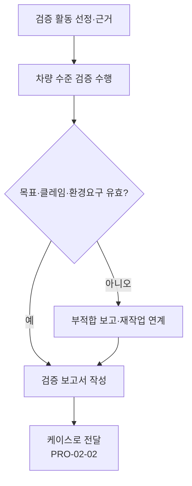

# 차량 수준 사이버보안 검증 절차 (PRO-VCSMS-02-06)

> 상위 정책: [[POL-VCSMS-02_차량_사이버보안_엔지니어링_정책]] · 기준: [[표준프로세스_구성원칙]]

## 1. 목적
차량 수준에서 사이버보안 **목표의 적정성·달성, 클레임 및 운용환경 요구의 유효성**을 검증하여, 컨셉·개발 결과가 차량 통합 맥락에서 유효함을 확인한다.

## 2. 적용 범위
ISO/SAE 21434 Clause 11(§11.4)에 적용한다. 입력은 제품개발([[PRO-VCSMS-02-05_제품개발_사이버보안_엔지니어링_절차]])의 산출물, 출력은 케이스([[PRO-VCSMS-02-02_사이버보안_케이스_평가_및_릴리스_절차]])의 검증 근거다.

## 3. 역할과 책임 (RACI)
| 단계 | CSM | 검증 엔지니어 | Project CS Lead |
|---|---|---|---|
| 검증 활동 선정·근거 | A | **R** | C |
| 차량 수준 검증 수행 | I | **R/A** | C |
| 검증 보고 | A | **R** | C |

## 4. 절차 흐름


## 5. 단계별 상세
| # | 단계 | 설명 | 담당 | 입력 | 출력 |
|---|---|---|---|---|---|
| 1 | 활동 선정 | 검증 활동 선정·선정 근거 제시 | 검증 엔지니어 | 개발 산출물 | 검증 계획·근거 |
| 2 | 검증 수행 | 목표 적정성·달성·클레임·환경요구 유효성 확인 | 검증 엔지니어 | 검증 계획 | 검증 결과 |
| 3 | 보고 | 결과·부적합 보고 | 검증 엔지니어 | 검증 결과 | 검증 보고서 (WP-11-01) |

## 6. 연계 업무지침 (WI)
- [[WI-VCSMS-02-06-01_검증_활동_선정_및_근거_제시]]
- [[WI-VCSMS-02-06-02_차량_수준_사이버보안_검증_수행]]
- [[WI-VCSMS-02-06-03_검증_보고서_작성]]

## 7. 통제점 / KPI
| 통제점 | 지표 | 목표 | 주기 |
|---|---|---|---|
| 선정 근거 | 근거 없는 검증 활동 | 0건 | 프로젝트 |
| 목표 달성 | 검증 목표 달성율 | 100% | 프로젝트 |
| 부적합 종결 | 검증 부적합 종결율 | 100% | 프로젝트 |

## 8. 표준 매핑 (Traceability)
| 표준 조항 | Req-ID (native) | 반영 위치 |
|---|---|---|
| §11.4 | VCSMS-R-092 ([RQ-11-01]) | §5 단계 2 |
| §11.4 | VCSMS-R-093 ([RQ-11-02]) | §5 단계 1 |

## 9. 출처 (source_citation)
```yaml
- type: standard_original
  file: "inputs/01_표준원문/AutoCyberSec/requirements.yaml"
  locator: "ISO/SAE 21434:2021 §11.4 [RQ-11-01,02]"
  retrieved_at: "2026-06-14"
  license: "ISO/SAE copyright"
  paraphrase_only: true
- type: business_flow
  file: "inputs/06_목표흐름/business_flow.yaml"
  locator: "SC-011"
  retrieved_at: "2026-06-14"
  license: "내부 자산"
```

## 10. 개정 이력
| 버전 | 일자 | 변경내용 | 승인자 |
|---|---|---|---|
| 0.1 | 2026-06-14 | 최초 초안 — Clause 11 차량 수준 검증 절차 | (미승인) |
