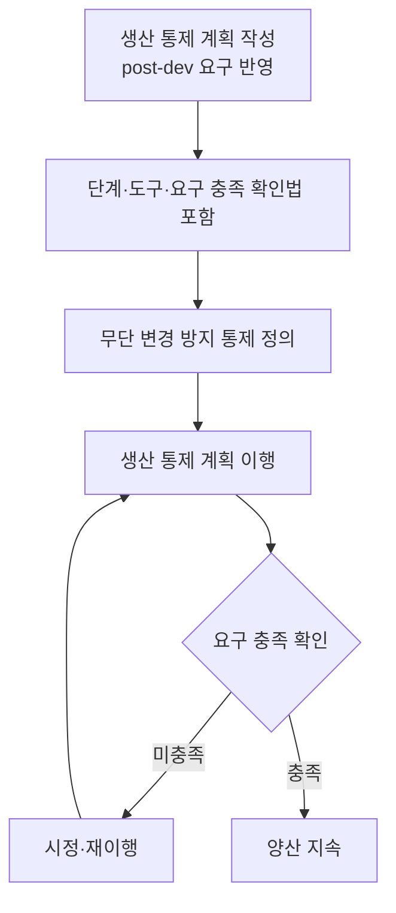

# 생산 사이버보안 통제 절차 (PRO-VCSMS-02-07)

> 상위 정책: [[POL-VCSMS-02_차량_사이버보안_엔지니어링_정책]] · 기준: [[표준프로세스_구성원칙]]

## 1. 목적
생산 단계에서 post-development 사이버보안 요구를 **생산 통제 계획 작성 → 무단변경 방지 통제 정의 → 이행**의 흐름으로 적용하여, 양산 산출물이 사이버보안 요구를 충족하고 무단 변경되지 않도록 한다.

## 2. 적용 범위
ISO/SAE 21434 Clause 12(§12.4)에 적용한다. 입력은 릴리스([[PRO-VCSMS-02-02_사이버보안_케이스_평가_및_릴리스_절차]])의 post-dev 요구다.

> **경계면 참조** — 생산 프로세스 일반·형상 관리는 상위 QMS/생산관리를 참조한다 (MAT-07 Interface 대상).

## 3. 역할과 책임 (RACI)
| 단계 | CSM | 생산기술 | 생산 라인 | Project CS Lead |
|---|---|---|---|---|
| 통제 계획 작성 | A | **R** | C | C |
| 무단변경 방지 통제 | A | **R** | C | C |
| 계획 이행 | I | A | **R** | I |

## 4. 절차 흐름


## 5. 단계별 상세
| # | 단계 | 설명 | 담당 | 입력 | 출력 |
|---|---|---|---|---|---|
| 1 | 계획 작성 | post-dev 요구 반영, 단계·도구·확인법 포함 | 생산기술 | post-dev 요구 | 생산 통제 계획 (WP-12-01) |
| 2 | 통제 정의 | 무단 변경 방지 통제 정의 | 생산기술 | 계획 | 통제 정의 |
| 3 | 이행 | 계획 이행·요구 충족 확인 | 생산 라인 | 통제 정의 | 이행 기록 |

## 6. 연계 업무지침 (WI)
- [[WI-VCSMS-02-07-01_생산_통제_계획_작성]]
- [[WI-VCSMS-02-07-02_무단_변경_방지_통제_정의]]
- [[WI-VCSMS-02-07-03_생산_통제_계획_이행]]

## 7. 통제점 / KPI
| 통제점 | 지표 | 목표 | 주기 |
|---|---|---|---|
| 계획 적용 | post-dev 요구 반영율 | 100% | 양산 |
| 무단변경 | 무단 변경 발생 건수 | 0건 | 분기 |
| 요구 충족 | 생산 사이버보안 요구 충족율 | 100% | 분기 |

## 8. 표준 매핑 (Traceability)
| 표준 조항 | Req-ID (native) | 반영 위치 |
|---|---|---|
| §12.4 | VCSMS-R-094 ([RQ-12-01]) | §5 단계 1 |
| §12.4 | VCSMS-R-095 ([RQ-12-02]) | §5 단계 1~2 |
| §12.4 | VCSMS-R-096 ([RQ-12-03]) | §5 단계 3 |

## 9. 출처 (source_citation)
```yaml
- type: standard_original
  file: "inputs/01_표준원문/AutoCyberSec/requirements.yaml"
  locator: "ISO/SAE 21434:2021 §12.4 [RQ-12-01~03]"
  retrieved_at: "2026-06-14"
  license: "ISO/SAE copyright"
  paraphrase_only: true
- type: business_flow
  file: "inputs/06_목표흐름/business_flow.yaml"
  locator: "SC-012"
  retrieved_at: "2026-06-14"
  license: "내부 자산"
```

## 10. 개정 이력
| 버전 | 일자 | 변경내용 | 승인자 |
|---|---|---|---|
| 0.1 | 2026-06-14 | 최초 초안 — Clause 12 생산 사이버보안 통제 절차 | (미승인) |
