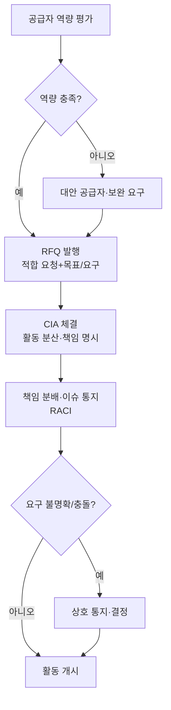

# 분산 사이버보안 활동 및 공급망 절차 (PRO-VCSMS-02-08)

> 상위 정책: [[POL-VCSMS-02_차량_사이버보안_엔지니어링_정책]] · 기준: [[표준프로세스_구성원칙]]

## 1. 목적
분산(공급망) 사이버보안 활동을 **공급자 역량 평가 → RFQ → 인터페이스 합의(CIA) → 책임 분배·이슈 통지**의 흐름으로 관리하여, 고객·공급자 간 사이버보안 책임이 명확하게 합의되도록 한다.

## 2. 적용 범위
ISO/SAE 21434 Clause 7(§7.4.1–7.4.3)에 적용한다. 활동 분산 시 고객·공급자가 각자 사이버보안 계획을 정의([[PRO-VCSMS-02-01_프로젝트_사이버보안_관리_절차]] [RQ-06-10])하며, 취약점 관리([[PRO-VCSMS-01-03_지속적_사이버보안_활동_및_취약점_관리_절차]])와 책임 합의를 연계한다.

> **경계면 참조** — 공급자 선정·계약·평가 일반은 상위 공급자관리(§8.4)를 참조한다. 사이버보안 측면만 CIA 로 명시한다 (MAT-07 Interface 대상).

## 3. 역할과 책임 (RACI)
| 단계 | CSM | 조달 담당 | Project CS Lead | 공급자 |
|---|---|---|---|---|
| 역량 평가 | A | C | **R** | C |
| RFQ 발행 | C | **R** | C | I |
| CIA 체결 | **A** | C | R | C |
| 책임 분배·이슈 통지 | A | I | **R** | C |

## 4. 절차 흐름


## 5. 단계별 상세
| # | 단계 | 설명 | 담당 | 입력 | 출력 |
|---|---|---|---|---|---|
| 1 | 역량 평가 | 후보 공급자 본 표준 준거 수행 역량 평가 | Project CS Lead | 공급자 역량 기록 | 역량 평가 결과 |
| 2 | RFQ | 적합 요청·책임 인수 기대·목표/요구 포함 | 조달 담당 | 역량 결과 | RFQ |
| 3 | CIA 체결 | 분산 활동·책임을 CIA 에 명시·상호 합의 | Project CS Lead | RFQ | CIA (WP-07-01) |
| 4 | 책임 운영 | 책임 매트릭스(RACI), 이슈 상호 통지·결정 | Project CS Lead | CIA | 책임 분배·통지 기록 |

## 6. 연계 업무지침 (WI)
- [[WI-VCSMS-02-08-01_공급자_사이버보안_역량_평가]]
- [[WI-VCSMS-02-08-02_RFQ_발행]]
- [[WI-VCSMS-02-08-03_사이버보안_인터페이스_합의_CIA_체결]]
- [[WI-VCSMS-02-08-04_책임_분배_및_이슈_통지_운영]]

## 7. 통제점 / KPI
| 통제점 | 지표 | 목표 | 주기 |
|---|---|---|---|
| 역량 평가 | 신규 공급자 역량 평가율 | 100% | 분기 |
| CIA 체결 | 분산 활동 CIA 보유율 | 100% | 프로젝트 |
| 책임 명확성 | 미합의 책임 항목 | 0건 | 프로젝트 |
| 이슈 통지 | 요구 충돌 통지 이행율 | 100% | 프로젝트 |

## 8. 표준 매핑 (Traceability)
| 표준 조항 | Req-ID (native) | 반영 위치 |
|---|---|---|
| §7.4.1 | VCSMS-R-052, 053 ([RQ-07-01], [RC-07-02]) | §5 단계 1 |
| §7.4.2 | VCSMS-R-054 ([RQ-07-03]) | §5 단계 2 |
| §7.4.3 | VCSMS-R-055~059 ([RQ/RC-07-04~08]) | §5 단계 3~4 |

## 9. 출처 (source_citation)
```yaml
- type: standard_original
  file: "inputs/01_표준원문/AutoCyberSec/requirements.yaml"
  locator: "ISO/SAE 21434:2021 §7.4.1–7.4.3 [RQ/RC-07-01~08]"
  retrieved_at: "2026-06-14"
  license: "ISO/SAE copyright"
  paraphrase_only: true
- type: business_flow
  file: "inputs/06_목표흐름/business_flow.yaml"
  locator: "SC-013"
  retrieved_at: "2026-06-14"
  license: "내부 자산"
```

## 10. 개정 이력
| 버전 | 일자 | 변경내용 | 승인자 |
|---|---|---|---|
| 0.1 | 2026-06-14 | 최초 초안 — Clause 7 분산 활동·공급망 절차 | (미승인) |
