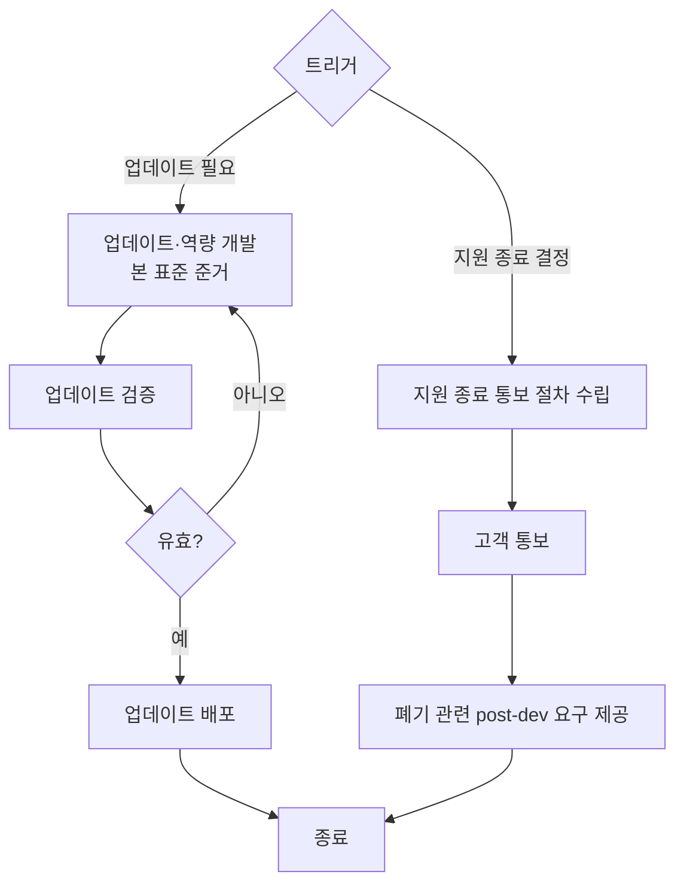

# 운영·업데이트 및 지원종료·폐기 절차 (PRO-VCSMS-02-09)

> 상위 정책: [[POL-VCSMS-02_차량_사이버보안_엔지니어링_정책]] · 기준: [[표준프로세스_구성원칙]]

## 1. 목적
운영 후반의 사이버보안 활동을 **업데이트 개발·배포**와 **지원 종료 통보·폐기 요구 제공**의 흐름으로 관리하여, 수명주기 종료 시점까지 사이버보안을 유지하고 안전한 종료·폐기를 지원한다.

## 2. 적용 범위
ISO/SAE 21434 §13.4(업데이트, SC-016)와 Clause 14(§14.3 지원종료·§14.4 폐기, SC-017)에 적용한다. 사고대응([[PRO-VCSMS-01-04_사이버보안_사고_대응_절차]])에서 업데이트가 필요한 경우 호출되며, 업데이트 개발은 본 표준 V-model([[PRO-VCSMS-02-05_제품개발_사이버보안_엔지니어링_절차]])을 재적용한다.

> **경계면 참조** — 차량 내 업데이트·업데이트 역량은 UNECE R156(SUMS, [[REF-002_UNECE_R156_SUMS_요약_v0.1]])과 정합한다 (MAT-07 Interface 대상).

## 3. 역할과 책임 (RACI)
| 단계 | CSM | 개발팀 | 운영/필드 | 고객 소통 |
|---|---|---|---|---|
| 업데이트 개발 | A | **R** | C | I |
| 업데이트 검증·배포 | A | R | **R** | C |
| 지원 종료 통보 절차 | **A** | C | C | R |
| 폐기 요구 제공 | **A** | R | C | C |

## 4. 절차 흐름


## 5. 단계별 상세
| # | 단계 | 설명 | 담당 | 입력 | 출력 |
|---|---|---|---|---|---|
| 1 | 업데이트 개발 | 차량 내 업데이트·역량을 본 표준 따라 개발 | 개발팀 | 변경 요구 | 업데이트 |
| 2 | 검증·배포 | 개발 프로세스 재적용 검증 후 배포 | 운영/필드 | 업데이트 | 배포 기록 |
| 3 | 지원 종료 통보 | 지원 종료 결정 시 고객 통보 절차 수립·통보 | 고객 소통 | 종료 결정 | 통보 절차 (WP-14-01) |
| 4 | 폐기 요구 제공 | 폐기 관련 post-dev 사이버보안 요구 가용화 | CSM | 종료 절차 | 폐기 요구 |

## 6. 연계 업무지침 (WI)
- [[WI-VCSMS-02-09-01_업데이트_역량_개발]]
- [[WI-VCSMS-02-09-02_업데이트_검증_및_배포]]
- [[WI-VCSMS-02-09-03_지원_종료_통보_절차_수립_통보]]
- [[WI-VCSMS-02-09-04_폐기_관련_post_development_요구사항_제공]]

## 7. 통제점 / KPI
| 통제점 | 지표 | 목표 | 주기 |
|---|---|---|---|
| 업데이트 검증 | 미검증 배포 건수 | 0건 | 배포 시 |
| 지원 종료 통보 | 종료 결정→통보 이행율 | 100% | 종료 시 |
| 폐기 요구 | 폐기 요구 가용성 | 100% | 종료 시 |

## 8. 표준 매핑 (Traceability)
| 표준 조항 | Req-ID (native) | 반영 위치 |
|---|---|---|
| §13.4 | VCSMS-R-099 ([RQ-13-03]) | §5 단계 1~2 |
| §14.3 | VCSMS-R-100 ([RQ-14-01]) | §5 단계 3 |
| §14.4 | VCSMS-R-101 ([RQ-14-02]) | §5 단계 4 |

## 9. 출처 (source_citation)
```yaml
- type: standard_original
  file: "inputs/01_표준원문/AutoCyberSec/requirements.yaml"
  locator: "ISO/SAE 21434:2021 §13.4 [RQ-13-03], §14.3–14.4 [RQ-14-01,02]"
  retrieved_at: "2026-06-14"
  license: "ISO/SAE copyright"
  paraphrase_only: true
- type: business_flow
  file: "inputs/06_목표흐름/business_flow.yaml"
  locator: "SC-016, SC-017"
  retrieved_at: "2026-06-14"
  license: "내부 자산"
```

## 10. 개정 이력
| 버전 | 일자 | 변경내용 | 승인자 |
|---|---|---|---|
| 0.1 | 2026-06-14 | 최초 초안 — §13.4·Clause 14 운영·업데이트·지원종료·폐기 절차 | (미승인) |
