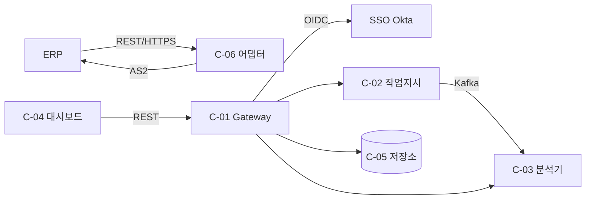

# 인터페이스 요구사항 정의서 작성예시 (EX-CMMI-03-01-02-02)

> 원본 양식: [[TMP-CMMI-03-01-02-02_인터페이스_요구사항_정의서]]

## 샘플 컨텍스트
"알파-MES v2" 의 18개 인터페이스 중 일부.

## 1. 문서 정보 (샘플)
| 항목 | 예시값 |
|---|---|
| 문서번호 | IR-SPEC-2026-007 |
| 버전 | 1.0 |
| 프로젝트 | 알파-MES-v2 |
| 작성자 | 김OO (Req Eng) |
| 작성일 | 2026-05-13 |
| 승인자 | 정OO (PM) |

## 2. 인터페이스 카테고리 (샘플)
| 유형 | 수 | 비고 |
|---|---|---|
| 내부 인터페이스 | 13 | 컴포넌트 간 |
| 외부 인터페이스 | 5 | ERP, MES Gateway, BI, 인증SSO, 모니터링 |

## 3. 인터페이스 요구사항 표 (일부 샘플)
| IR-ID | 유형 | From | To | 데이터 | 프로토콜 | SLA | 예외 처리 | 우선순위 |
|---|---|---|---|---|---|---|---|---|
| IR-EXT-01 | 외부 | ERP | C-06 ERP 어댑터 | JSON(WorkOrder v1.2) | REST/HTTPS | 99.9%, p95 ≤ 800ms | 5xx 시 Retry-3, DLQ 적재 | Must |
| IR-EXT-02 | 외부 | C-06 ERP 어댑터 | ERP | EDI X12 | AS2 | 99.5%, 1회/일 | 미수신 시 알림 + 수동 재전송 | Must |
| IR-EXT-03 | 외부 | C-01 Gateway | SSO (Okta) | OIDC token | OIDC 1.0 | 99.95% | 폴백: 로컬 ID/비밀번호 | Must |
| IR-INT-01 | 내부 | C-02 작업지시 | C-03 분석기 | Kafka Topic: workorder.events | Kafka 3.5 | end-to-end ≤ 3s | 컨슈머 다운시 lag 임계 발령 | Must |
| IR-INT-02 | 내부 | C-04 대시보드 | C-01 Gateway | REST(JSON) | HTTPS | p95 ≤ 1.5s | 401 시 재로그인 유도 | Must |

## 4. 인터페이스 다이어그램 (샘플)

## 5. 의존 외부 시스템 (샘플)
| 시스템명 | 버전 | 담당 조직 | 합의 문서 |
|---|---|---|---|
| ERP (SAP S/4) | 2023 FPS02 | 고객 IT 본부 | MOU-2026-002 |
| Okta SSO | 2025.06 | 정보보안팀 | 표준 연동 가이드 v3 |
| Kafka | 3.5 (사내) | 플랫폼팀 | 사내 SLA 99.9% |

## 6. 결재 (샘플)
| 검토 | 승인 | 일자 |
|---|---|---|
| 이OO (Chief Eng), 한OO (PI) | 정OO (PM) | 2026-05-14 |

## 작성 시 유의사항
- 4요소(데이터·프로토콜·SLA·예외) 누락 시 본 WI 미완료.
- 외부 인터페이스는 합의 문서(MOU/계약) ID 의무.
- Mermaid 다이어그램 또는 외부 첨부 1개 이상.

## 잘못된 작성 사례
> ❌ "ERP 연동" 한 줄로 IR 1건만 기술
> ✅ 방향성(In/Out) 분리 — IR-EXT-01(In), IR-EXT-02(Out)

> ❌ SLA "고가용성" 등 정성 표현
> ✅ "99.9%, p95 ≤ 800ms" 등 정량 명시
