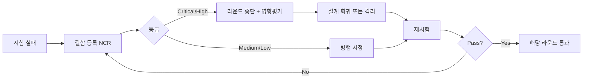

# 제품 통합 전략·환경·절차서 작성예시 (EX-CMMI-03-03-01-01)

> 원본 양식: [[TMP-CMMI-03-03-01-01_제품_통합_전략_환경_절차서]]

## 샘플 컨텍스트
"알파-MES v2" — 6개 컴포넌트 4라운드 통합.

## 1. 문서 정보 (샘플)
| 항목 | 예시값 |
|---|---|
| 문서번호 | PI-PLAN-2026-007 |
| 버전 | 1.0 |
| 프로젝트 | 알파-MES-v2 Phase 1 |
| 작성자 | 박OO (Integration Lead) |
| 작성일 | 2026-09-15 |
| 승인자 | 정OO (PM) |

## 2. 통합 전략 (샘플)
| 항목 | 내용 |
|---|---|
| 전략 | **Incremental + Bottom-up** |
| 근거 | 마이크로서비스 구성 — 저장소·이벤트 버스부터 위로 |
| 의존성 그래프 첨부 | `pi-dep-graph-v1.png` |
| 순환 의존 | 없음 (C-01↔C-06 검토 후 단방향) |

## 3. 통합 환경 (샘플)
| 분류 | 항목 | 버전 | Owner | 가용 상태 |
|---|---|---|---|---|
| HW | AWS m6i.2xlarge × 6 | - | DevOps | ✅ |
| SW | Kubernetes 1.30 | 1.30.3 | DevOps | ✅ |
| 네트워크 | VPC + Transit Gateway | - | DevOps | ✅ |
| 데이터 | Anonymized fixture 5GB | v1.2 | 데이터팀 | ✅ |
| Mock | ERP Mock (WireMock) | 3.5 | 통합팀 | ✅ |
| Mock | Okta Sandbox | 2025.06 | 정보보안 | ✅ |

## 4. 라운드별 절차·기준 (샘플)
| 라운드 | 포함 | 진입 | 종료 | 합격 | 불합격 |
|---|---|---|---|---|---|
| R1 (인프라) | C-05 저장소 | TDP RC1 | smoke 100% | 모든 smoke pass | 자동 롤백 + 결함 등록 |
| R2 (코어 서비스) | C-02 + C-03 + Kafka | R1 통과 | sanity 100% + 단위 통합 OK | 인터페이스 시험 100% | 컴포넌트 격리 후 결함 등록 |
| R3 (Gateway+UI) | C-01 + C-04 | R2 통과 | UC-01~03 종합 시험 | UC pass rate ≥ 95% | UI 차단 + 결함 |
| R4 (외부 연동) | C-06 + Mock ERP | R3 통과 | 외부 통합 시험 | 합의 SLA 충족 | ERP 측 협의 후 재시험 |

## 5. 부적합 처리 흐름 (샘플)

## 6. 결재 (샘플)
| 검토 | 승인 | 일자 |
|---|---|---|
| 한OO (Architect), 김OO (CM), Test Eng | 정OO (PM) | 2026-09-16 |

## 작성 시 유의사항
- 라운드 수는 4±2 권장 — 너무 많으면 관리 부담, 너무 적으면 결함 격리 곤란.
- Mock 사용 부분은 정식 환경에서 재시험 일정 명시.

## 잘못된 작성 사례
> ❌ "다 함께 통합 후 시험" — Big-bang 사유 부재
> ✅ Bottom-up 등 명시 + 근거

> ❌ 진입·종료 기준 동일
> ✅ 진입(이전 통과) / 종료(시험 결과) 분리
