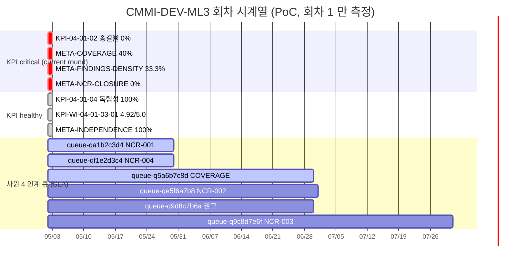

# MAT-008 KPI 대시보드

> 차원 3 (Check) `/audit --kpi` 하네스가 자동 갱신하는 정량 지표 대시보드. 자동 갱신 — 사람이 직접 수정 금지.
>
> **상위 인덱스**: [[MAT-005_심사증적_인덱스]] §"심사 이력" / [[MAT-006_NCR_관리대장]]
> **운영 가이드**: `표준_프로세스_심사_가이드.md` §6.3 KPI 대시보드 / §11 트러블슈팅

## 1. 워크플로우

```
[/audit --kpi start <표준코드> --period <from..to>]
   ├ kpi-collector → kpi_data.yaml (PRO/WI §KPI 추출 + REC/MAT 측정)
   └ kpi-analyzer → 임계 비교·회귀 판정·MAT-008 갱신·MAT-006 §통계 갱신

[정기 운영 (분기·반기 권장)]
   └ 표준별 회차 N → N+1 측정 시 baseline 자동 비교 (직전 회차 대비 회귀 탐지)

[차원 4 인계 (Phase 4 자동화 예정)]
   └ verdict: critical 인 KPI 의 root cause → 차원 4 입력 큐
```

## 2. Verdict 4-tier

| 표시 | verdict | 조건 |
|---|---|---|
| 🟢 | healthy | 목표 충족 + 추세 stable/improved |
| 🟡 | watch | 목표 충족 + 추세 regressed (목표 충족이나 하락 중) |
| 🟠 | recovering | 목표 미달 + 추세 improved |
| 🔴 | critical | 목표 미달 + 추세 stable/regressed |
| ⚪ | data_gap | 측정 불가 (sample_size==0 또는 baseline 부재로 1회차 seed 등) |

## 3. KPI 정의 source

- **정의 KPI**: 각 PRO 의 §6 / §7 "통제점/KPI" 표 + WI 의 §9 "KPI" 표 자동 추출 (kpi-collector).
- **메타 KPI** (차원 3 자체):
  - `META-COVERAGE` 심사 Coverage (WI 단위) — target ≥ 80%
  - `META-FINDINGS-DENSITY` Findings 밀도 (finding/requirement) — target ≤ 20%
  - `META-INDEPENDENCE` 독립성 검증 통과율 — target = 100%
  - `META-NCR-CLOSURE` NCR 종결율 (전사) — target ≥ 95%
  - `META-NCR-SLA` NCR SLA 준수율 — target ≥ 90%

## 4. Baseline 운영 규칙

- 첫 측정 (회차 1) → baseline **seed** (회귀 비교 없음, 임계 비교만).
- 회차 ≥ 2 → 직전 회차의 같은 kpi_id 측정값을 baseline 으로 자동 사용.
- 회귀 임계 default: `±5.0%p` (방향성 휴리스틱은 `direction: higher_is_better / lower_is_better`).
- 사용자 지정: `/audit --kpi start ... --regression-threshold-pp 3.0`

---

## CMMI-DEV-ML3

> 차원 3 KPI 측정 시계열. `/audit --kpi` 가 자동 갱신. 회차별 KPI 1행 누적.

### 회차 시계열

| 회차 | 측정 기간 | 측정일 | KPI ID | KPI 명 | 카테고리 | 목표 | 측정값 | 단위 | verdict | baseline | delta | trace |
|---|---|---|---|---|---|---|---|---|---|---|---|---|
| 1 | 2026-01-01..2026-04-30 | 2026-05-02 | KPI-CMMI-04-01-01 | 감사 계획 준수율 | compliance | >=95% | — | % | ⚪ data_gap | — (seed) | — | run-k4f8d2a1 |
| 1 | 2026-01-01..2026-04-30 | 2026-05-02 | KPI-CMMI-04-01-02 | 부적합 종결율 | defect | >=95% | 0.0 | % | 🔴 critical | — (seed) | — | run-k4f8d2a1 |
| 1 | 2026-01-01..2026-04-30 | 2026-05-02 | KPI-CMMI-04-01-03 | 부적합 평균 종결 기간 | defect | <=20영업일 | — | 영업일 | ⚪ data_gap | — (seed) | — | run-k4f8d2a1 |
| 1 | 2026-01-01..2026-04-30 | 2026-05-02 | KPI-CMMI-04-01-04 | QA 독립성 점검 | independence | =100% | 100.0 | % | 🟢 healthy | — (seed) | — | run-k4f8d2a1 |
| 1 | 2026-01-01..2026-04-30 | 2026-05-02 | KPI-CMMI-04-01-05 | 동일 부적합 재발률 | defect | <10% | — | % | ⚪ data_gap | — (seed) | — | run-k4f8d2a1 |
| 1 | 2026-01-01..2026-04-30 | 2026-05-02 | KPI-WI-04-01-03-01 | 산출물 품질 점수 | quality | >=4.0 | 4.92 | 점/5.0 | 🟢 healthy | — (seed) | — | run-k4f8d2a1 |
| 1 | 2026-01-01..2026-04-30 | 2026-05-02 | META-COVERAGE | 심사 Coverage (WI) | compliance | >=80% | 40.0 | % | 🔴 critical | — (seed) | — | run-k4f8d2a1 |
| 1 | 2026-01-01..2026-04-30 | 2026-05-02 | META-FINDINGS-DENSITY | Findings 밀도 | defect | <=20% | 33.3 | % | 🔴 critical | — (seed) | — | run-k4f8d2a1 |
| 1 | 2026-01-01..2026-04-30 | 2026-05-02 | META-INDEPENDENCE | 독립성 통과율 | independence | =100% | 100.0 | % | 🟢 healthy | — (seed) | — | run-k4f8d2a1 |
| 1 | 2026-01-01..2026-04-30 | 2026-05-02 | META-NCR-CLOSURE | NCR 종결율 (전사) | defect | >=95% | 0.0 | % | 🔴 critical | — (seed) | — | run-k4f8d2a1 |
| 1 | 2026-01-01..2026-04-30 | 2026-05-02 | META-NCR-SLA | NCR SLA 준수율 | defect | >=90% | — | % | ⚪ data_gap | — (seed) | — | run-k4f8d2a1 |

### 회차 1 결과 요약 (2026-05-02, run-k4f8d2a1)

- **🟢 healthy**: 3건 (KPI-04-01-04 독립성 / KPI-WI-04-01-03-01 산출물 품질 / META-INDEPENDENCE)
- **🟡 watch**: 0건 (1회차 baseline seed 라 추세 비교 미수행)
- **🟠 recovering**: 0건
- **🔴 critical**: 4건 (KPI-04-01-02 종결율 / META-COVERAGE / META-FINDINGS-DENSITY / META-NCR-CLOSURE)
- **⚪ data_gap**: 4건 (KPI-04-01-01 감사 계획 준수율 / KPI-04-01-03 평균 종결 기간 / KPI-04-01-05 재발률 / META-NCR-SLA)
- 총 측정: 7건 / 정의된 KPI: 11건 (정의 6 + 메타 5)

### 회귀 알림 (current round 1)

> 1회차는 baseline seed 라 회귀 판정은 미수행. 본 회차의 critical 4건은 **임계 미달** 만으로 발생.

| KPI ID | KPI 명 | 측정값 / 목표 | verdict | 차원 4 (Act) 권고 |
|---|---|---|---|---|
| KPI-CMMI-04-01-02 | 부적합 종결율 | 0.0% / >=95% | 🔴 critical | NCR-001 (F-001) / NCR-002 (F-002) 종결 가속 — SLA 2026-05-30 |
| META-COVERAGE | 심사 Coverage (WI) | 40.0% / >=80% | 🔴 critical | WI-04-01-01 / WI-04-01-02 / WI-04-01-05 운영 시작 (REQ-003·REQ-006·REQ-011·REQ-012 not_assessed 해결) |
| META-FINDINGS-DENSITY | Findings 밀도 | 33.3% / <=20% | 🔴 critical | F-001~F-004 NCR 종결 + 차원 4 권고 §6 의 PRO/WI 개정으로 다음 분기 finding 감소 유도 |
| META-NCR-CLOSURE | NCR 종결율 (전사) | 0.0% / >=95% | 🔴 critical | KPI-04-01-02 와 동일 — NCR 4건 시정조치 종결 우선 |

### data_gap 분석 (회차 1)

| KPI ID | 데이터 부재 사유 | 측정 가능 시점 |
|---|---|---|
| KPI-CMMI-04-01-01 감사 계획 준수율 | 감사 계획서 REC 0건 (REQ-003 not_assessed) | WI-04-01-02 운영 시작 후 |
| KPI-CMMI-04-01-03 평균 종결 기간 | NCR 종결 0건 (n=0) | 첫 NCR 종결 후 |
| KPI-CMMI-04-01-05 재발률 | 1회차 — 재발 비교 baseline 부재 | 회차 ≥ 2 |
| META-NCR-SLA | NCR 종결 0건 (n=0) | 첫 NCR 종결 후 |

### 다음 회차 권고

- **회차 2 측정 시점**: 2026-Q3 (2026-07-01 ~ 09-30) 또는 NCR 일부 종결 후 임의 시점.
- **목표**: data_gap 4건 중 ≥ 2건 측정 가능 상태 도달 + critical 4건 중 ≥ 1건 recovering 으로 전환.
- **명령**: `/audit --kpi start CMMI-DEV-ML3 --period 2026-04-01..2026-06-30` (2회차 자동 baseline 비교).

### 차원 4 인계 (act queue) — Phase 4

> 본 표는 act-trigger 가 confirm / kpi finalize 직후 자동 발행한 차원 4 (Act) 큐. NCR 미종결·KPI critical·권고를 차원 1 재트리거 후보로 구조화.

| Queue ID | kind | priority | source | target | proposed_action | due | status |
|---|---|---|---|---|---|---|---|
| [[queue-qa1b2c3d4]] | ncr_capa | critical | NCR-001 (F-001 / REQ-005) | PRO-CMMI-04-01 | `/build-standard ... --from write --target PRO-CMMI-04-01` | 2026-05-30 | **done** (run-c4f8a1b2 / 차원 1 재트리거 대기) |
| [[queue-qe5f6a7b8]] | ncr_capa | major | NCR-002 (F-002 / REQ-007) | PRO-CMMI-04-01 (§7 명문화) | `/build-standard ... --from write --target PRO-CMMI-04-01` | 2026-07-01 | pending |
| [[queue-q9c8d7e6f]] | ncr_capa | minor | NCR-003 (F-003 / REQ-009) | REC-CMMI-04-01-03-01-2026-001 | `/do WI-CMMI-04-01-03 --reissue ...` | 2026-07-31 | pending |
| [[queue-qf1e2d3c4]] | ncr_capa | critical | NCR-004 (F-004 / REQ-010) | WI-CMMI-04-01-04 | `/build-standard ... --from write --target WI-CMMI-04-01-04` | 2026-05-30 | pending |
| [[queue-q5a6b7c8d]] | kpi_critical | critical | META-COVERAGE 40% / ≥80% | WI-04-01-{01,02,05} | `/do WI-CMMI-04-01-01` 등 운영 시작 | 2026-06-30 | pending |
| [[queue-q9d8c7b6a]] | recommendation | major | 보고서 §6 권고 2번 (KPI 측정 명문화) | PRO-CMMI-04-01 (§7) | `/build-standard ... --from write --target PRO-CMMI-04-01` | 2026-06-30 | pending |

총 6 큐 (kind: ncr_capa 4 / kpi_critical 1 / recommendation 1; priority: critical 4 / major 1 / minor 1).

> KPI critical 통합 사례:
> - KPI-CMMI-04-01-02 (부적합 종결율) → NCR-001 큐의 `kpi_alerts[]` 통합 (root cause 동일)
> - META-FINDINGS-DENSITY → NCR-001 큐 통합
> - META-NCR-CLOSURE → NCR-001 큐 통합
> - META-COVERAGE → 신규 큐 (관련 NCR 없음)
>
> 권고 통합: "WI-04-01-04 SLA 정의" 권고 → NCR-004 큐의 linked_recommendations 통합. "WI-04-01-01 운영 시작" → COVERAGE 큐 통합. "PRO §7 KPI 측정 명문화" 만 단독 권고 큐.

### 시계열 시각화 (Mermaid PoC)



> 본 다이어그램은 회차 2 부터는 시계열 트렌드 (회귀/개선 화살표) 로 확장 권장. Phase 4.5+ 에서 자동 트렌드 다이어그램 도입.

---

> 본 대시보드는 자동 갱신됩니다. 직접 수정 시 차원 3 시계열 추적성이 손상되며, 다음 `/audit --kpi` 실행 시 검증 위반으로 처리됩니다.
