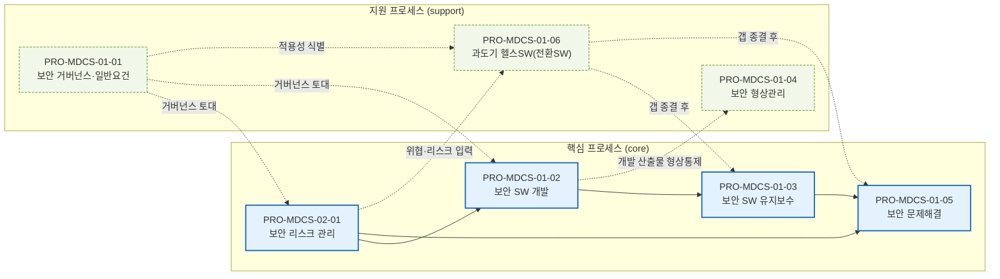
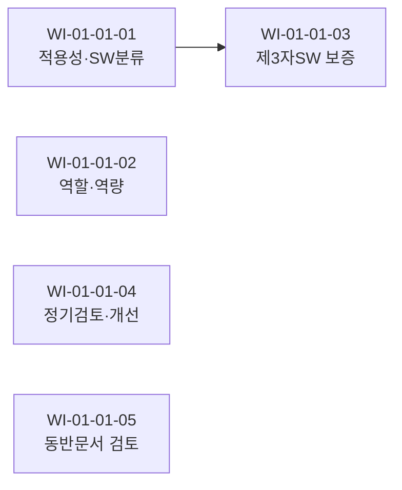

# 프로세스 플로우 맵 — MDCS (IEC 81001-5-1)

> 파생 문서 — PRO frontmatter(`follows`/`precedes`/`pro_type`/`wi_sequence`)가 진실의 원천이다.
> PRO 변경 후 `/process-plan --flow` 로 재생성한다. 본 맵은 **MDCS 표준 단독 뷰**이며, 타 표준이 빌드되면 통합 뷰로 확장된다.

## 1. 핵심 프로세스 흐름 (PRO 선후관계)

`core` = 메인 흐름(실선) · `support` = 지원 프로세스(점선 연계).
설계 단계 확정 흐름: 거버넌스 → 리스크관리 → 개발 → 유지보수 → 문제해결. 형상관리는 개발 후속, 전환SW는 거버넌스·리스크관리 후속.

## 2. PRO 목록 (선후관계 + 유형)

| PRO ID | 제목 | 유형 | 선행(follows) | 후행(precedes) | 표준 조항 |
|--------|------|------|---------------|----------------|-----------|
| [[PRO-MDCS-01-01_보안_거버넌스_및_일반요건_관리_절차_v0.1\|PRO-MDCS-01-01]] | 보안 거버넌스 및 일반요건 관리 | support | — | 02-01, 01-02, (01-06) | Clause 4 |
| [[PRO-MDCS-02-01_보안_리스크_관리_프로세스_절차_v0.1\|PRO-MDCS-02-01]] | 보안 리스크 관리 | core | 01-01 | 01-02, 01-05, (01-06) | Clause 7 + 4.2 |
| [[PRO-MDCS-01-02_보안_SW_개발_프로세스_절차_v0.1\|PRO-MDCS-01-02]] | 보안 SW 개발 | core | 01-01, 02-01 | 01-03, 01-04 | Clause 5 |
| [[PRO-MDCS-01-03_보안_SW_유지보수_프로세스_절차_v0.1\|PRO-MDCS-01-03]] | 보안 SW 유지보수 | core | 01-02, (01-06) | 01-05 | Clause 6 |
| [[PRO-MDCS-01-04_보안_형상관리_프로세스_절차_v0.1\|PRO-MDCS-01-04]] | 보안 형상관리 | support | 01-02 | — | Clause 8 |
| [[PRO-MDCS-01-05_보안_문제해결_프로세스_절차_v0.1\|PRO-MDCS-01-05]] | 보안 문제해결 | core | 01-03, 02-01, (01-06) | — | Clause 9 + 4.1.7 |
| [[PRO-MDCS-01-06_과도기_헬스SW_관리_절차_v0.1\|PRO-MDCS-01-06]] | 과도기 헬스SW(전환SW) | support | 01-01, 02-01 | 01-03, 01-05 | Annex F |

> `( )` 는 support PRO 의 연계 후행(점선)이며 메인 흐름 엣지가 아니다.

## 3. 각 PRO 내 WI 시퀀스 (entry-gate 흐름)

각 WI 의 `entry_condition` 은 PRO `wi_sequence` 의 진입 게이트다. `→` 는 순차, 게이트 없는 WI 는 병렬 진입 가능.

### PRO-MDCS-01-01 보안 거버넌스 (support, 5 WI)

- WI-MDCS-01-01-01 적용성·SW분류 → WI-MDCS-01-01-03 제3자SW 보증 *(entry: 01-01-01.done)*
- WI-MDCS-01-01-02 역할·역량 / 01-04 정기검토·개선 / 01-05 동반문서 검토 *(독립 진입)*

### PRO-MDCS-02-01 보안 리스크 관리 (core, 5 WI)
- WI-02-01-01 보안 맥락 → 02 위협모델링 → 03 리스크 추정·평가 → 04 리스크 통제 *(순차 게이트)*
- WI-02-01-05 위협모델 정기검토·출시후 모니터링 *(독립 진입)*

### PRO-MDCS-01-02 보안 SW 개발 (core, 8 WI)
- WI-01-02-01 개발계획 → 02 요구정의 → 03 아키텍처 → 04 설계 → 05 구현(정적분석) → 07 시스템시험 → 08 릴리스 검증 *(순차 게이트)*
- WI-01-02-06 통합시험 *(should/mandatory:false, entry: 05.done)* — 선택 경로
- 분기: 05 구현 → {06 통합시험(선택), 07 시스템시험}

### PRO-MDCS-01-03 보안 SW 유지보수 (core, 4 WI)
- WI-01-03-03 업데이트 검증 → 04 안내·제공·무결성 *(entry: 03.done)*
- WI-01-03-01 업데이트 정책 / 02 취약점 모니터링 *(독립 진입)*

### PRO-MDCS-01-04 보안 형상관리 (support, 2 WI)
- WI-01-04-01 변경통제·이력 / 02 SBOM 인벤토리 *(독립 진입)*

### PRO-MDCS-01-05 보안 문제해결 (core, 6 WI)
- WI-01-05-01 접수 → 02 조사 → 03 분석 → 04 처리·교차통지 → 05 공개 *(순차 게이트)*
- WI-01-05-06 미해결 이슈 정기검토 *(독립 진입)*

### PRO-MDCS-01-06 과도기 헬스SW (support, 3 WI)
- WI-01-06-01 Clause4 구현·갭분석 → 02 갭종결 → 03 정당화·전환계획 *(순차 게이트)*

## 4. 플로우 통계

| 항목 | 값 |
|------|-----|
| PRO 노드 | 7 (core 4 / support 3) |
| WI 노드 | 33 |
| PRO 간 엣지 | 11 (core 메인 5 / support 연계 6) |
| 순환(cycle) | 없음 (DAG) |
| 진입점(루트) | PRO-MDCS-01-01 (선행 없음) |
| 종착점(리프) | PRO-MDCS-01-04, PRO-MDCS-01-05 |

> 검증: `follows`/`precedes` 양방향 일관성 확인됨. 01-04(형상)는 리프(precedes 없음), 01-05(문제해결)는 다중 선행(01-03·02-01·01-06) 수렴. 순환 미검출.
