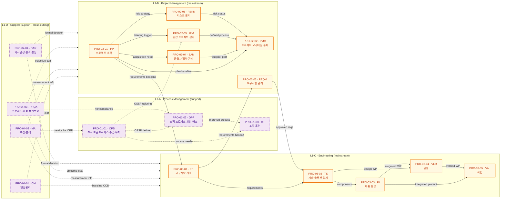
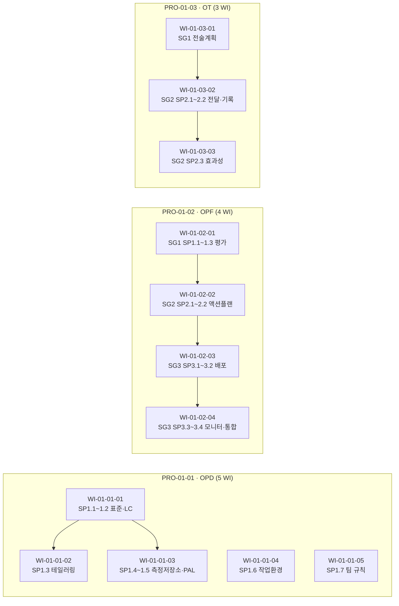
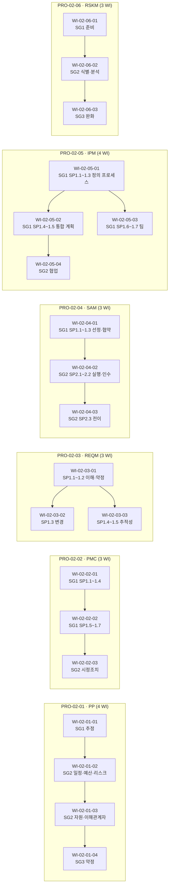
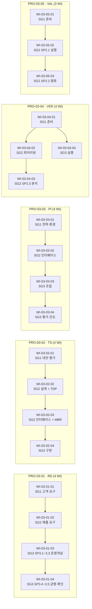
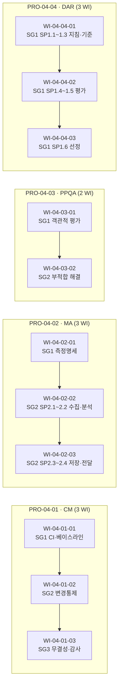

# CMMI-DEV V1.3 ML3 프로세스 플로우 맵 (MAT-010)

> **파생 문서** — 이 파일은 18개 PRO 의 frontmatter (`pro_type` / `follows` / `precedes` / `wi_sequence`) 와 `pa_relationships.yaml` 의 카테고리 구조에서 자동 파생된다.  
> PRO frontmatter 변경 후 `/process-plan --flow` 로 재생성한다.  
> 출처: CMU/SEI-2010-TR-033 (CMMI-DEV V1.3) Part One Ch.4 (p.39-53), `inputs/06_목표흐름/business_flow.yaml` (OPT-7 / 전체 22 PA scope).

---

## 1. 요약 통계

| 항목 | 값 |
|---|---|
| L1 카테고리 (PA 군집) | 4 (Process Mgmt / Project Mgmt / Engineering / Support) |
| L2 PRO 수 | 18 (ML2 7 + ML3 11) |
| L3 WI 수 | 62 |
| follows 엣지 (PRO 선행) | 16 |
| precedes 엣지 (PRO 후행) | 16 |
| Cross-cutting 엣지 (Support → 전체) | 4 (CM, MA, PPQA, DAR — pa_relationships *-supports-all) |
| 순환(cycle) 감지 | 0 — DAG 검증 통과 |
| mainstream PRO | 11 (PP, PMC, REQM, SAM, IPM, RSKM, RD, TS, PI, VER, VAL) |
| support PRO | 7 (OPD, OPF, OT, CM, MA, PPQA, DAR) |

---

## 2. L1 — 카테고리(PA 군집) 간 의존성

`pa_relationships.yaml` Part One Ch.4 (p.39-53) 의 4개 카테고리·Basic/Advanced 분류를 그대로 사용한다.

```mermaid
flowchart TB
  classDef pm fill:#e3f2fd,stroke:#1565c0,color:#0d47a1
  classDef prj fill:#fff3e0,stroke:#ef6c00,color:#bf360c
  classDef eng fill:#e8f5e9,stroke:#2e7d32,color:#1b5e20
  classDef sup fill:#f3e5f5,stroke:#6a1b9a,color:#4a148c

  PM["L1-A · Process Management<br/>(OPD · OPF · OT)<br/>p.39-41 Basic"]:::pm
  PRJ["L1-B · Project Management<br/>Basic: PP · PMC · REQM · SAM (p.43-45)<br/>Advanced: IPM · RSKM (p.45-47)"]:::prj
  ENG["L1-C · Engineering<br/>RD → TS → PI / VER · VAL<br/>p.47-50"]:::eng
  SUP["L1-D · Support<br/>Basic: CM · MA · PPQA (p.51-52)<br/>Advanced: DAR (p.52-53)"]:::sup

  PM -->|OSSP / OPA / Training| PRJ
  PM -->|OSSP tailoring| ENG
  PRJ -->|Product & Component Requirements| ENG
  SUP -.->|CM/MA/PPQA/DAR cross-cutting<br/>(*-supports-all)| PM
  SUP -.->|cross-cutting| PRJ
  SUP -.->|cross-cutting| ENG
```

**근거 (pa_relationships cross_cutting_principles)**:
- `BPM-feeds-OT` (p.40): OPF/OPD → OT
- `BPM-enables-APM` (p.45): Basic PM (PP/PMC/REQM/SAM) → Advanced PM (IPM/RSKM)
- `CM-supports-all` / `MA-supports-all` / `PPQA-supports-all` / `DAR-supports-all` (p.51-53)
- `REQM-feeds-RD-TS` (p.45): PRJ.REQM ↔ ENG.RD/TS
- Engineering process flow (p.47-49): Customer → RD → TS → PI → Customer (with VER+VAL feedback)

---

## 3. L2 — PRO 간 선후 관계 (follows / precedes)

각 PRO frontmatter 의 `follows[]` / `precedes[]` 를 방향성 엣지로 통합한 메인스트림 흐름이다. Support PRO 는 점선·subgraph 로 표현한다.



**근거 — 각 PRO frontmatter `follows[]` / `precedes[]` 요약 (총 32 엣지)**:

| 엣지 | 출처 PRO | follows/precedes | 근거 (pa_relationships) |
|---|---|---|---|
| OPD → OPF | PRO-01-02.follows | OPD가 OSSP 정의 → OPF가 개선·배포 | BPM Basic Figure 4.1 |
| OPD → OT | PRO-01-03.follows | OPD/OPF → OT (training on standard processes) | BPM-feeds-OT (p.40) |
| OPF → OT | PRO-01-03.follows | 개선된 프로세스 → OT 교육과정 반영 | BPM-feeds-OT (p.40) |
| OPD → IPM | PRO-02-05.follows | OSSP → tailoring for project's defined process | APM dep. (p.45) |
| PP → PMC | PRO-02-02.follows | 계획 → 모니터링 baseline | PP-baseline-for-PMC (p.44) |
| PP → IPM | PRO-02-05.follows | PP commitment → IPM 정의 프로세스 수행 | BPM-enables-APM (p.45) |
| PP → RSKM | PRO-02-06.follows | PP risk strategy(SP2.2) → RSKM 정밀 관리 | RSKM SG1 (p.351) |
| PP → SAM | PRO-02-04.follows | 인수 항목 식별 후 공급자 협약 | SAM Figure 4.3 |
| PP → RD | PRO-03-01.follows | 프로젝트 commitment 후 RD 착수 | PM→ENG (p.43-47) |
| SAM → PMC | PRO-02-04.precedes | 공급자 인수 결과 → 프로젝트 모니터링 | SAM Figure 4.3 |
| IPM → PMC | PRO-02-05.precedes | tailored 프로세스 → PMC 적용 | APM (p.45-47) |
| RSKM → PMC | PRO-02-06.precedes | 리스크 status → PMC 통합 | APM (p.45-47) |
| RD → REQM | PRO-02-03.follows | RD 산출 요구사항 → REQM 통제 | REQM-feeds-RD-TS (p.45) |
| REQM → TS | PRO-03-02.follows | 승인된 요구사항 → TS 설계 입력 | REQM-feeds-RD-TS (p.45) |
| RD → TS | PRO-03-02.follows | 요구사항 → 기술해결 | Engineering flow (p.47) |
| TS → PI | PRO-03-03.follows | 컴포넌트 → 통합 | Engineering flow (p.47) |
| TS → VER | PRO-03-04.follows | 설계 산출물 → 검증 | Engineering flow (p.47-49) |
| PI → VER | PRO-03-04.follows | 통합 산출물 → 검증 | Engineering flow (p.47-49) |
| PI → VAL | PRO-03-05.follows | 통합 제품 → 확인 | VER-before-VAL (p.49) |
| VER → VAL | PRO-03-05.follows | 검증 → 확인 | VER-before-VAL (p.49) |
| CM → ALL | (cross-cutting) | 베이스라인·CCB로 전체 PA 무결성 지원 | CM-supports-all (p.52) |
| MA → ALL | (cross-cutting) | 측정정보 전체 PA 지원 | MA-supports-all (p.51) |
| PPQA → ALL | (cross-cutting) | 객관적 평가 전체 PA 지원 | PPQA-supports-all (p.51) |
| DAR → ALL | (cross-cutting) | 형식적 의사결정 전체 PA 지원 | DAR-supports-all (p.53) |
| PPQA → OPF | (개선 feedback) | 부적합 결과 → OPF 개선 액션 | business_flow.yaml SCN-D3→SCN-A2 |
| MA → OPD | (성과 환류) | 프로젝트 측정값 → 조직 측정저장소 | OPD SP1.4 (p.241) |

**순환(cycle) 검증**: 모든 엣지를 위상 정렬(Kahn algorithm)한 결과 사이클 없음. mainstream-only DAG = [PP → {PMC, SAM, IPM, RSKM, RD}, SAM → PMC, IPM → PMC, RSKM → PMC, RD → {REQM, TS}, REQM → TS, TS → {PI, VER}, PI → {VER, VAL}, VER → VAL].

---

## 4. L3 — PRO 내부 WI 시퀀스 (62 WI)

각 PRO 의 `wi_sequence[]` (entry_condition 포함) 를 시각화한다.

### 4.1 Process Management



### 4.2 Project Management



### 4.3 Engineering



### 4.4 Support



---

## 5. PRO 인덱스 — 카테고리·ML·인접·WI 수

| PRO ID | 제목 | PA | 카테고리 | ML | pro_type | follows | precedes | WI 수 |
|---|---|---|---|---|---|---|---|---|
| PRO-CMMI-01-01 | OSSP 수립·유지 | OPD | Process Mgmt (Basic) | ML3 | support | — | OPF, OT, IPM | 5 |
| PRO-CMMI-01-02 | 프로세스 개선·배포 | OPF | Process Mgmt (Basic) | ML3 | support | OPD | OT | 4 |
| PRO-CMMI-01-03 | 조직 훈련 | OT | Process Mgmt (Basic) | ML3 | support | OPD, OPF | — | 3 |
| PRO-CMMI-02-01 | 프로젝트 계획 | PP | Project Mgmt (Basic) | ML2 | mainstream | — | PMC, IPM, RSKM, RD | 4 |
| PRO-CMMI-02-02 | 프로젝트 모니터링·통제 | PMC | Project Mgmt (Basic) | ML2 | mainstream | PP | — | 3 |
| PRO-CMMI-02-03 | 요구사항 관리 | REQM | Project Mgmt (Basic) | ML2 | mainstream | RD | TS | 3 |
| PRO-CMMI-02-04 | 공급자 협약 관리 | SAM | Project Mgmt (Basic) | ML2 | mainstream | PP | PMC | 3 |
| PRO-CMMI-02-05 | 통합 프로젝트 관리 | IPM | Project Mgmt (Adv) | ML3 | mainstream | PP, OPD | PMC | 4 |
| PRO-CMMI-02-06 | 리스크 관리 | RSKM | Project Mgmt (Adv) | ML3 | mainstream | PP | PMC | 3 |
| PRO-CMMI-03-01 | 요구사항 개발 | RD | Engineering | ML3 | mainstream | PP | REQM, TS | 4 |
| PRO-CMMI-03-02 | 기술 솔루션 설계 | TS | Engineering | ML3 | mainstream | RD, REQM | PI, VER | 4 |
| PRO-CMMI-03-03 | 제품 통합 | PI | Engineering | ML3 | mainstream | TS | VER, VAL | 4 |
| PRO-CMMI-03-04 | 검증 | VER | Engineering | ML3 | mainstream | TS, PI | VAL | 4 |
| PRO-CMMI-03-05 | 확인 | VAL | Engineering | ML3 | mainstream | VER, PI | — | 3 |
| PRO-CMMI-04-01 | 형상 관리 | CM | Support (Basic) | ML2 | support | (cross-cutting) | (ALL) | 3 |
| PRO-CMMI-04-02 | 측정 및 분석 | MA | Support (Basic) | ML2 | support | (cross-cutting) | (ALL) | 3 |
| PRO-CMMI-04-03 | 프로세스·제품 품질보증 | PPQA | Support (Basic) | ML2 | support | (cross-cutting) | (ALL) | 2 |
| PRO-CMMI-04-04 | 의사결정 분석·결정 | DAR | Support (Adv) | ML3 | support | (cross-cutting) | (ALL) | 3 |

**합계**: PRO 18 / WI 62 / mainstream 11 / support 7

---

## 6. business_flow.yaml 시나리오 매핑

| 시나리오 | PA | 매핑 PRO | 매핑 WI 수 |
|---|---|---|---|
| SCN-A1 OSSP 정의·유지 | OPD | PRO-CMMI-01-01 | 5 |
| SCN-A2 프로세스 개선 사이클 | OPF | PRO-CMMI-01-02 | 4 |
| SCN-A3 교육 체계 | OT | PRO-CMMI-01-03 | 3 |
| SCN-B1 프로젝트 기획 | PP | PRO-CMMI-02-01 | 4 |
| SCN-B2 모니터링·시정조치 | PMC | PRO-CMMI-02-02 | 3 |
| SCN-B3 요구사항 관리 | REQM | PRO-CMMI-02-03 | 3 |
| SCN-B4 리스크 관리 | RSKM | PRO-CMMI-02-06 | 3 |
| SCN-B5 공급자 합의 관리 | SAM | PRO-CMMI-02-04 | 3 |
| SCN-B6 통합 프로젝트 관리 | IPM | PRO-CMMI-02-05 | 4 |
| SCN-C1 요구사항 개발 | RD | PRO-CMMI-03-01 | 4 |
| SCN-C2 기술 해결 | TS | PRO-CMMI-03-02 | 4 |
| SCN-C3 제품 통합·인도 | PI | PRO-CMMI-03-03 | 4 |
| SCN-C4 검증 | VER | PRO-CMMI-03-04 | 4 |
| SCN-C5 확인 | VAL | PRO-CMMI-03-05 | 3 |
| SCN-D1 형상관리 | CM | PRO-CMMI-04-01 | 3 |
| SCN-D2 측정·분석 | MA | PRO-CMMI-04-02 | 3 |
| SCN-D3 PPQA | PPQA | PRO-CMMI-04-03 | 2 |
| SCN-D4 DAR | DAR | PRO-CMMI-04-04 | 3 |

**참고**: ML3 cumulative scope (`state.yaml.scope.pa_count = 18`) — business_flow.yaml 의 ML4/ML5 시나리오 (SCN-A4 OPP, SCN-A5 OPM, SCN-B7 QPM, SCN-D5 CAR) 4건은 본 빌드 scope 외이며 추후 ML4/ML5 확장 빌드에서 PRO 추가 후 본 MAT 재생성.

---

## 7. 갱신·재생성 규약

- 본 파일은 PRO frontmatter 의 직접 파생이다. 수동 편집 금지.
- PRO 의 `follows[]` / `precedes[]` / `wi_sequence[]` 변경 시 `/process-plan --flow` 또는 `flow-mapper` 에이전트 재실행.
- 재실행 시 `generated_at` 갱신, 본 파일 전체 덮어쓰기.
- 참조 무결성: 18개 PRO 가 모두 `vault/04_PRO_절차/` 에 존재해야 함 (현재 18/18 OK).
- 사이클 검증: Kahn algorithm 위상정렬 통과 (현재 0 cycle).

---

*Derived from PRO frontmatters + pa_relationships.yaml — last regenerated 2026-05-11T10:00:00+09:00 by flow-mapper.*
