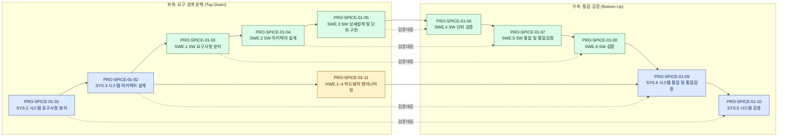
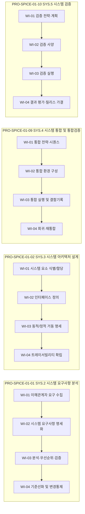
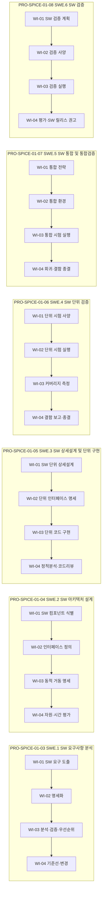
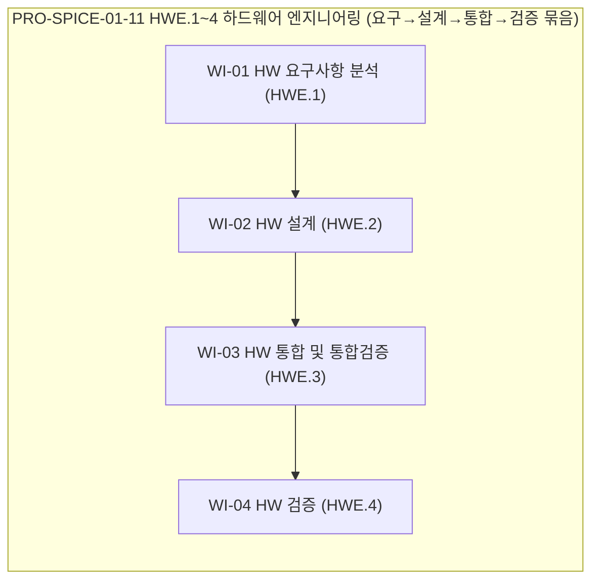

# 프로세스 플로우 맵 (Automotive SPICE 4.0)

> 파생 문서 — `vault/04_PRO_절차/PRO-SPICE-01-*.md`의 frontmatter(`follows` / `precedes` / `wi_sequence`)를 진실의 원천으로 한다. PRO frontmatter가 변경되면 `/process-plan --flow ASPICE-4.0` 으로 본 문서를 재생성한다.

## 0. 개요

VWAY Motors ASPICE 4.0 적용 범위는 **SYS(System Engineering) · SWE(Software Engineering) · HWE(Hardware Engineering)** 의 V-모델 11개 핵심 프로세스다. 본 맵은 PRO 간 선후관계(`follows`/`precedes`)와 각 PRO의 WI 시퀀스(`wi_sequence`)를 통합 가시화하여 V-모델 좌측(요구·설계 분해) → 우측(통합·검증) 흐름을 한 화면에서 추적하도록 한다.

| 구분 | 수량 | 비고 |
|---|---|---|
| 핵심(core) PRO | 11 | SYS 4 + SWE 6 + HWE 1 |
| 지원(support) PRO | 0 | 본 차원에서는 미정의 (MAN/SUP/ACQ/SPL은 별도 표준 편입 시 확장) |
| 플로우 엣지(`follows`/`precedes`) | 14 | 메인 V-모델 분해/통합 흐름 (양방향 동치 1세트) |
| 순환(cycle) 감지 | 없음 | DAG 무결성 OK |

## 1. PRO 간 관계도 (V-모델 — Mermaid)

## 2. PRO–WI 계층 구조 (wi_sequence)

각 PRO는 ASPICE 4.0 BP(Base Practice) 묶음을 따라 `wi_sequence[]` 로 분해된다. WI 코드는 `WI-SPICE-01-{PRO##}-{WI##}` 규약을 따른다.

### 2.1 SYS 프로세스 (4)

### 2.2 SWE 프로세스 (6)

### 2.3 HWE 프로세스 (1, 묶음)

## 3. 프로세스 그룹별 흐름 요약

### 3.1 PRO 마스터 표

| PRO ID | ASPICE 프로세스 | 그룹 | pro_type | follows | precedes | WI 수 | V-모델 위치 |
|---|---|---|---|---|---|---|---|
| PRO-SPICE-01-01 | SYS.2 시스템 요구사항 분석 | SYS | core | — | PRO-SPICE-01-02 | 4 | 좌(요구) |
| PRO-SPICE-01-02 | SYS.3 시스템 아키텍처 설계 | SYS | core | PRO-SPICE-01-01 | PRO-SPICE-01-03, PRO-SPICE-01-11 | 4 | 좌(설계) |
| PRO-SPICE-01-03 | SWE.1 SW 요구사항 분석 | SWE | core | PRO-SPICE-01-02 | PRO-SPICE-01-04 | 4 | 좌(요구) |
| PRO-SPICE-01-04 | SWE.2 SW 아키텍처 설계 | SWE | core | PRO-SPICE-01-03 | PRO-SPICE-01-05 | 4 | 좌(설계) |
| PRO-SPICE-01-05 | SWE.3 SW 상세설계·단위구현 | SWE | core | PRO-SPICE-01-04 | PRO-SPICE-01-06 | 4 | 좌(구현) |
| PRO-SPICE-01-06 | SWE.4 SW 단위 검증 | SWE | core | PRO-SPICE-01-05 | PRO-SPICE-01-07 | 4 | 우(단위검증) |
| PRO-SPICE-01-07 | SWE.5 SW 통합·통합검증 | SWE | core | PRO-SPICE-01-06 | PRO-SPICE-01-08 | 4 | 우(통합) |
| PRO-SPICE-01-08 | SWE.6 SW 검증 | SWE | core | PRO-SPICE-01-07 | PRO-SPICE-01-09 | 4 | 우(SW검증) |
| PRO-SPICE-01-09 | SYS.4 시스템 통합·통합검증 | SYS | core | PRO-SPICE-01-08, PRO-SPICE-01-11 | PRO-SPICE-01-10 | 4 | 우(시스템통합) |
| PRO-SPICE-01-10 | SYS.5 시스템 검증 | SYS | core | PRO-SPICE-01-09 | — | 4 | 우(시스템검증) |
| PRO-SPICE-01-11 | HWE.1~4 하드웨어 엔지니어링 | HWE | core | PRO-SPICE-01-02 | PRO-SPICE-01-09 | 4 | 좌·우 묶음 |

### 3.2 그룹별 진입/종료 PRO

| 그룹 | 진입 PRO | 종료 PRO | 내부 흐름 요약 |
|---|---|---|---|
| SYS (System) | PRO-SPICE-01-01 | PRO-SPICE-01-10 | 01 → 02 → (분해) → 09 → 10 |
| SWE (Software) | PRO-SPICE-01-03 | PRO-SPICE-01-08 | 03 → 04 → 05 → 06 → 07 → 08 |
| HWE (Hardware) | PRO-SPICE-01-11 | PRO-SPICE-01-11 | 11 단일 PRO 내부에 HWE.1→2→3→4 직렬 |

### 3.3 V-모델 트레이서빌리티 매핑 (좌 ↔ 우)

| 좌측(분해) | 우측(검증) | 의미 |
|---|---|---|
| PRO-SPICE-01-01 (SYS 요구) | PRO-SPICE-01-10 (시스템 검증) | 시스템 요구사항 ↔ 최상위 검증 |
| PRO-SPICE-01-02 (SYS 아키) | PRO-SPICE-01-09 (시스템 통합검증) | 시스템 아키텍처 ↔ 통합검증 |
| PRO-SPICE-01-03 (SW 요구) | PRO-SPICE-01-08 (SW 검증) | SW 요구 ↔ SW 검증 |
| PRO-SPICE-01-04 (SW 아키) | PRO-SPICE-01-07 (SW 통합검증) | SW 아키텍처 ↔ SW 통합검증 |
| PRO-SPICE-01-05 (SW 상세설계) | PRO-SPICE-01-06 (SW 단위검증) | SW 단위 ↔ 단위검증 |
| PRO-SPICE-01-11 (HW 엔지니어링) | PRO-SPICE-01-09 (시스템 통합검증) | HW 산출물 ↔ 시스템 통합 합류 |

### 3.4 게이트(필수 통과 조건)

| 게이트 | 위치 | 통과 조건 |
|---|---|---|
| G1: 시스템 요구 기준선 | PRO-01 → PRO-02 | SYS 요구사항 baseline + 변경통제 발효 |
| G2: 시스템 아키텍처 승인 | PRO-02 → PRO-03 / PRO-11 | SYS 아키텍처 승인 + SW/HW 할당 확정 |
| G3: SW 요구 기준선 | PRO-03 → PRO-04 | SW 요구사항 baseline + SYS 추적성 OK |
| G4: SW 아키텍처 승인 | PRO-04 → PRO-05 | SW 아키텍처 승인 + 자원·시간 분석 OK |
| G5: 코드 기준선 | PRO-05 → PRO-06 | 단위 구현 완료 + 정적분석 critical 0 |
| G6: 단위검증 합격 | PRO-06 → PRO-07 | 단위 시험 통과 + 코드 커버리지 목표 충족 |
| G7: SW 통합 합격 | PRO-07 → PRO-08 | 통합 시험 통과 + 회귀 결함 종결 |
| G8: SW 릴리스 권고 | PRO-08 → PRO-09 | SW 검증 합격 + SW 릴리스 노트 승인 |
| G9: 시스템 통합 합격 | PRO-09 → PRO-10 | SYS 통합검증 통과 + HW/SW 합류 OK |
| G10: 시스템 출하 가결 | PRO-10 → 출하 | 시스템 검증 합격 + 잔여 결함 처리 결정 |

## 4. 검증 절차 (flow-mapper Self-Check)

- [x] 모든 PRO frontmatter 의 `follows`/`precedes`가 양방향 정합 (한쪽만 있는 엣지 0건)
- [x] DAG 순환 없음 (위상정렬 가능)
- [x] V-모델 좌·우 매핑 5쌍 모두 트레이서빌리티 점선 표시
- [x] HWE 합류 지점(PRO-09)에서 SWE/HWE 양 라인 만남 확인
- [x] 모든 PRO에 `wi_sequence[]` ≥ 1 (최소 4 WI)

## 5. 변경 이력

| 일자 | 버전 | 내용 | 수행 |
|---|---|---|---|
| 2026-05-06 | 0.1 | 최초 생성 (ASPICE 4.0 11 core PRO V-모델 기준) | flow-mapper |

---

> **재생성 트리거**: PRO frontmatter (`pro_type` / `follows` / `precedes` / `wi_sequence`) 변경 시 → `/process-plan --flow ASPICE-4.0` 실행. 본 파일은 자동 덮어쓰기 대상이며 수기 편집 금지.
