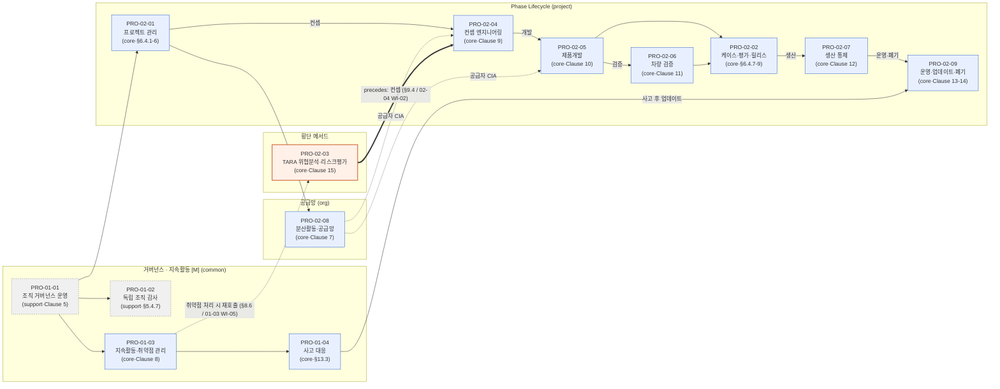

# VCSMS 프로세스 플로우 맵 (MAT-010)

> **파생 문서** — PRO frontmatter(`follows` / `precedes` / `pro_type` / `wi_sequence`)가 진실의 원천이다.
> PRO 의 선후관계·WI 시퀀스를 변경한 뒤 `/process-plan --flow` 로 재생성하라. 직접 편집 금지.
> 기준: [[표준프로세스_구성원칙]] · 정책: [[POL-VCSMS-01_자동차_사이버보안_거버넌스_정책]] · [[POL-VCSMS-02_차량_사이버보안_엔지니어링_정책]]

## 1. 개요

ISO/SAE 21434 기반 VCSMS 의 13개 절차(PRO)를 **phase lifecycle**(컨셉 → 개발 → 검증 → 생산 → 운영 → 폐기) 메인 흐름으로 연결하고, 모든 단계를 가로지르는 **횡단 TARA**(PRO-VCSMS-02-03)와 **거버넌스·지속활동([M] tier)**을 통합한 단일 플로우 맵이다.

- PRO 총 13개 (core 9 / support 4) — `pro_type` 기준
- WI 총 60개 — 각 PRO 의 `wi_sequence` 합산
- 플로우 엣지 17개 — `precedes` 선언 기준
- 순환(cycle) 감지: **없음** (TARA 의 `precedes: [02-04]` 와 컨셉 02-04 의 §9.4 내부 호출은 방향성 충돌 없이 단방향 메서드 호출로 처리)

## 2. 통합 프로세스 플로우 (Mermaid)


```mermaid
flowchart LR
  %% ===== 거버넌스 / 지속활동 [M] =====
  subgraph GOV["거버넌스 · 지속활동 [M] (common)"]
    direction TB
    P0101["PRO-01-01<br/>조직 거버넌스 운영<br/>(support·Clause 5)"]
    P0102["PRO-01-02<br/>독립 조직 감사<br/>(support·§5.4.7)"]
    P0103["PRO-01-03<br/>지속활동·취약점 관리<br/>(core·Clause 8)"]
    P0104["PRO-01-04<br/>사고 대응<br/>(core·§13.3)"]
    P0101 --> P0102
    P0101 --> P0103
    P0103 --> P0104
  end

  %% ===== Phase Lifecycle 메인 흐름 =====
  subgraph LIFE["Phase Lifecycle (project)"]
    direction LR
    P0201["PRO-02-01<br/>프로젝트 관리<br/>(core·§6.4.1-6)"]
    P0204["PRO-02-04<br/>컨셉 엔지니어링<br/>(core·Clause 9)"]
    P0205["PRO-02-05<br/>제품개발<br/>(core·Clause 10)"]
    P0206["PRO-02-06<br/>차량 검증<br/>(core·Clause 11)"]
    P0202["PRO-02-02<br/>케이스·평가·릴리스<br/>(core·§6.4.7-9)"]
    P0207["PRO-02-07<br/>생산 통제<br/>(core·Clause 12)"]
    P0209["PRO-02-09<br/>운영·업데이트·폐기<br/>(core·Clause 13-14)"]
    P0201 -->|컨셉| P0204
    P0204 -->|개발| P0205
    P0205 -->|검증| P0206
    P0205 --> P0202
    P0206 --> P0202
    P0202 -->|생산| P0207
    P0207 -->|운영·폐기| P0209
  end

  %% ===== 공급망 =====
  subgraph SUP["공급망 (org)"]
    P0208["PRO-02-08<br/>분산활동·공급망<br/>(core·Clause 7)"]
  end

  %% ===== 횡단 TARA =====
  subgraph TARA["횡단 메서드"]
    P0203["PRO-02-03<br/>TARA 위협분석·리스크평가<br/>(core·Clause 15)"]
  end

  %% ===== PRO 간 선후관계 (follows/precedes) =====
  P0101 --> P0201
  P0201 --> P0208
  P0208 -.->|공급자 CIA| P0204
  P0208 -.->|공급자 CIA| P0205
  P0104 -->|사고 후 업데이트| P0209

  %% ===== 횡단 TARA 호출 (점선) =====
  P0203 ==>|"precedes: 컨셉 (§9.4 / 02-04 WI-02)"| P0204
  P0103 -.->|"취약점 처리 시 재호출 (§8.6 / 01-03 WI-05)"| P0203

  classDef core fill:#e8f0ff,stroke:#3366cc,stroke-width:1px;
  classDef support fill:#f0f0f0,stroke:#888,stroke-dasharray:3 3;
  classDef tara fill:#fff0e8,stroke:#cc6633,stroke-width:2px;
  class P0103,P0104,P0201,P0202,P0204,P0205,P0206,P0207,P0208,P0209 core;
  class P0101,P0102 support;
  class P0203 tara;
```

## 3. 단계 체인 요약

### 3.1 메인 lifecycle 체인 (project)
```
PRO-02-01 (프로젝트 관리)
  → PRO-02-04 (컨셉, Clause 9)
  → PRO-02-05 (제품개발, Clause 10)
  → PRO-02-06 (차량 검증, Clause 11)
  → PRO-02-02 (케이스·평가·릴리스, §6.4.7-9)   ← 02-05·02-06 합류
  → PRO-02-07 (생산 통제, Clause 12)
  → PRO-02-09 (운영·업데이트·폐기, Clause 13-14)
```

### 3.2 거버넌스·지속활동 체인 ([M] tier, common)
```
PRO-01-01 (조직 거버넌스)
  → PRO-01-02 (독립 감사)
  → PRO-01-03 (지속활동·취약점 관리)
       → PRO-01-04 (사고 대응)  → PRO-02-09 (운영·업데이트)
  → PRO-02-01 (프로젝트 관리, lifecycle 진입점)
```

### 3.3 공급망 분기 (org)
```
PRO-02-01 → PRO-02-08 (분산활동·공급망 CIA)
              ⇢ PRO-02-04 (컨셉, 공급자 요구 반영)
              ⇢ PRO-02-05 (제품개발, 공급자 통합)
```

## 4. 횡단 TARA 호출 관계 (핵심)

TARA(PRO-VCSMS-02-03, Clause 15)는 **lifecycle 의 한 단계가 아니라 호출되는 횡단 메서드**다. `follows: []`, `precedes: [PRO-VCSMS-02-04]` 로 선언되어 있으나, 실질적으로 두 지점에서 호출된다.

| 호출 지점 | 호출 PRO / WI | 표준 근거 | 성격 |
|-----------|---------------|-----------|------|
| **컨셉 단계** | PRO-02-04 / WI-VCSMS-02-04-02 (TARA 수행 호출 및 처리 옵션 결정) | §9.4 [RQ-09-03] | 초기 리스크 산정 — 목표·클레임 도출 입력 |
| **지속활동(운영)** | PRO-01-03 / WI-VCSMS-01-03-05 (취약점 관리 및 처리 결정) | §8.6 [RQ-08-07] | 신규 취약점에 대한 재평가 — 처리 결정 입력 |

→ 컨셉에서는 `precedes` 엣지(굵은 실선 ==>)로, 지속활동에서는 재호출(점선 -.->)로 표현했다. 두 경로 모두 TARA 산출물(리스크값·처리 결정)을 후속 절차에 전달하며 순환을 형성하지 않는다.

## 5. PRO 목록 (분류·선후관계)

| PRO ID | 제목 | pro_type | scope_type | tier | 선행(follows) | 후행(precedes) |
|--------|------|----------|-----------|------|---------------|----------------|
| [[PRO-VCSMS-01-01_조직_사이버보안_거버넌스_운영_절차\|PRO-01-01]] | 조직 거버넌스 운영 | support | common | M | — | 01-02, 01-03, 02-01 |
| [[PRO-VCSMS-01-02_독립_조직_사이버보안_감사_절차\|PRO-01-02]] | 독립 조직 감사 | support | common | M | 01-01 | — |
| [[PRO-VCSMS-01-03_지속적_사이버보안_활동_및_취약점_관리_절차\|PRO-01-03]] | 지속활동·취약점 관리 | core | common | M | 01-01 | 01-04, 02-03 |
| [[PRO-VCSMS-01-04_사이버보안_사고_대응_절차\|PRO-01-04]] | 사고 대응 | core | project | M | 01-03 | 02-09 |
| [[PRO-VCSMS-02-01_프로젝트_사이버보안_관리_절차\|PRO-02-01]] | 프로젝트 관리 | core | project | C | 01-01 | 02-02, 02-04, 02-08 |
| [[PRO-VCSMS-02-02_사이버보안_케이스_평가_및_릴리스_절차\|PRO-02-02]] | 케이스·평가·릴리스 | core | project | C | 02-01, 02-05, 02-06 | 02-07 |
| [[PRO-VCSMS-02-03_위협분석_및_리스크평가_TARA_절차\|PRO-02-03]] | TARA (횡단) | core | project | C | — | 02-04 |
| [[PRO-VCSMS-02-04_컨셉_단계_사이버보안_엔지니어링_절차\|PRO-02-04]] | 컨셉 엔지니어링 | core | project | C | 02-01, 02-03 | 02-05 |
| [[PRO-VCSMS-02-05_제품개발_사이버보안_엔지니어링_절차\|PRO-02-05]] | 제품개발 | core | project | C | 02-04 | 02-06, 02-02 |
| [[PRO-VCSMS-02-06_차량_수준_사이버보안_검증_절차\|PRO-02-06]] | 차량 검증 | core | project | C | 02-05 | 02-02 |
| [[PRO-VCSMS-02-07_생산_사이버보안_통제_절차\|PRO-02-07]] | 생산 통제 | core | org | C | 02-02 | 02-09 |
| [[PRO-VCSMS-02-08_분산_사이버보안_활동_및_공급망_절차\|PRO-02-08]] | 분산활동·공급망 | core | org | C | 02-01 | 02-04, 02-05 |
| [[PRO-VCSMS-02-09_운영_업데이트_및_지원종료_폐기_절차\|PRO-02-09]] | 운영·업데이트·폐기 | core | org | C | 02-07, 01-04 | — |

## 6. WI 시퀀스 요약 (PRO 내부 흐름)

entry_condition 표기: `→` 는 직전 WI done 의존, `⟂` 는 병렬(별도 선행 의존), `*` 는 mandatory:false(테일러링 가능).

| PRO ID | WI 시퀀스 (60개) |
|--------|------------------|
| PRO-01-01 | 01 정책·규칙 수립 → 02 책임·자원 배정 → 03 문화·역량 관리 / 02⟂04 정보공유·소통채널 / 02⟂05* 도구·형상정보 |
| PRO-01-02 | 01 감사계획·독립성 → 02 적합성 감사 → 03 감사보고·후속조치 |
| PRO-01-03 | 01 정보원·트리거 정의 → 02 수집·트리아지·이벤트 → 03 이벤트 평가·약점 → 04 약점 분석·취약점 → 05 취약점 관리·처리결정 (⇒ TARA 재호출) |
| PRO-01-04 | 01 사고대응 계획 → 02 이행·진척 모니터링 → 03 종료·후속조치 |
| PRO-02-01 | 01 책임 배정 → 02 관련성·신규/재사용 분석 → 03 계획 수립 / 03→04* 테일러링 / 02→05* 재사용·OTS·OOC / 03→06 계획갱신·형상관리 |
| PRO-02-02 | 01 케이스 작성 → 02 평가여부 결정·독립검토 → 03* 독립 평가 → 04* 평가보고서 → 05 post-dev 릴리스 |
| PRO-02-03 (TARA) | 01 자산 식별 → 02 위협 시나리오 / 01→03 영향평가 S/F/O/P / 02→04 공격경로 → 05 타당성 평가 → 06 리스크값(1-5) → 07 리스크 처리 결정 |
| PRO-02-04 (컨셉) | 01 아이템 정의 → 02 **TARA 호출**·처리옵션 → 03 목표·클레임 도출 → 04 목표·클레임 검증 → 05 컨셉·요구사항 정의/할당 → 06 컨셉 검증 |
| PRO-02-05 (개발) | 01 사양 정의·할당 → 02 설계·구현 원칙 / 01→03 아키텍처 약점분석 → 04 사양 검증 → 05 통합·검증 → 06 테스트 커버리지·취약점 테스트 |
| PRO-02-06 (검증) | 01 검증활동 선정·근거 → 02 차량 수준 검증 수행 → 03 검증보고서 작성 |
| PRO-02-07 (생산) | 01 생산통제 계획 작성 → 02 무단변경 방지통제 정의 → 03 생산통제 계획 이행 |
| PRO-02-08 (공급망) | 01 공급자 역량평가 → 02 RFQ 발행 → 03 CIA 체결 → 04 책임 분배·이슈 통지 |
| PRO-02-09 (운영·폐기) | 01* 업데이트 역량 개발 → 02* 업데이트 검증·배포 / 03* 지원종료 통보 → 04* 폐기 post-dev 요구 제공 |

## 7. 시나리오 그룹 매핑 (business_flow 참조)

| SG | 그룹명 | 시나리오 | 대응 PRO |
|----|--------|----------|----------|
| SG-1 | 거버넌스 체계 수립 | SC-001~004 | PRO-01-01, PRO-01-02 |
| SG-2 | 프로젝트 관리 | SC-005~007 | PRO-02-01, PRO-02-02 |
| SG-3 | TARA 수행 | SC-008 | PRO-02-03 (횡단) |
| SG-4 | 컨셉·개발 엔지니어링 | SC-009~012 | PRO-02-04, 02-05, 02-06, 02-07 |
| SG-5 | 공급망 | SC-013 | PRO-02-08 |
| SG-6 | 지속활동·운영 | SC-014~016 | PRO-01-03, 01-04, 02-09 |
| SG-7 | 종료·폐기 | SC-017 | PRO-02-09 |

---

> 생성: flow-mapper · 2026-06-14 · ISO/SAE 21434 기반 VCSMS · 순환 없음(cycle-free DAG + 횡단 TARA 메서드 호출)
