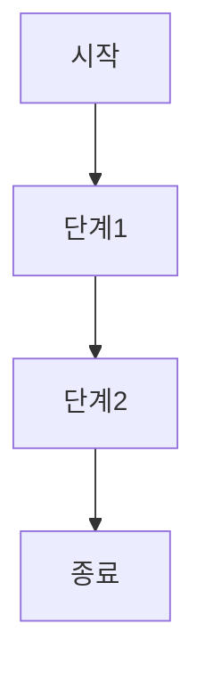

# {{절차명}} (PRO-{{영역}}-{{POL번호}}-{{PRO순번}})

> 상위 정책: [[POL-{{영역}}-{{POL번호}}_정책명]] · 기준: [[표준프로세스_구성원칙]]

## 1. 목적
## 2. 적용 범위
## 3. 역할과 책임 (RACI)
| 단계 | R | A | C | I |
|---|---|---|---|---|

## 4. 절차 흐름

| # | 단계 | 설명 | 담당 | 입력 | 출력 |
|---|---|---|---|---|---|
| 1 |  |  |  |  |  |

## 5. 연계 업무지침 (WI)
- [[WI-{{번호}}-01_...]]

## 6. 통제점 / KPI
| 통제점 | 지표 | 목표 | 주기 |
|---|---|---|---|

## 7. 표준 매핑 (Traceability)
| 표준 조항 | Req-ID | 반영 위치 |
|---|---|---|

## 8. 개정 이력
| 버전 | 일자 | 변경내용 | 승인자 |
|---|---|---|---|
