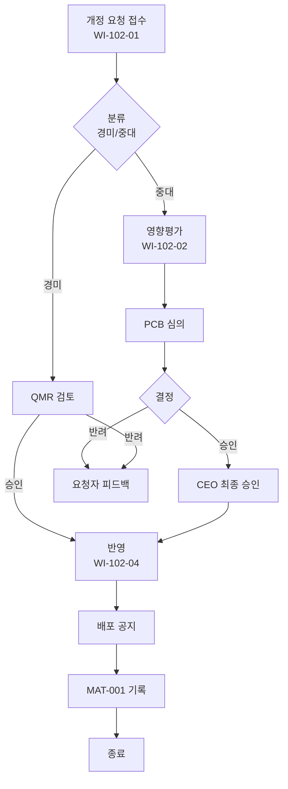

# 문서 개정 관리 절차 (GS-PRO-QMS-102)

> **[골든 샘플]** 이 문서는 `PRO` 유형의 품질 하한선 참조용입니다. 실제 산출물 아님.
> 상위 정책: [[GS-POL-QMS-002_문서화된정보_관리_정책]]

## 1. 목적
승인된 문서의 개정을 **영향평가 → 승인 → 반영 → 배포 → 기록** 의 통제된 흐름으로 관리하여, 구판 오용과 통제되지 않은 변경을 예방한다.

## 2. 적용 범위
본 절차는 **승인 상태(`status: approved`) 인 모든 8종 문서**의 개정에 적용한다. 초안(`draft`) 수정은 본 절차 대상이 아니다.

- **경미 개정(Minor, v1.n)**: 오탈자·링크 수정·소절 보완 (본문 논리·책임·범위 불변)
- **중대 개정(Major, v(n+1).0)**: 본문 구조·책임·적용범위·KPI 변경

## 3. 역할과 책임 (RACI)
| 단계 | 요청자 | Process Owner | QMR | PCB | CEO/승인자 |
|---|---|---|---|---|---|
| 개정 요청 접수 | **R** | C | I | I | - |
| 영향평가 | C | **R** | C | - | - |
| 경미 개정 승인 | - | C | **A** | I | - |
| 중대 개정 승인 | - | C | C | C | **A** |
| 반영·배포 | - | **R** | C | I | I |
| 기록(MAT-001) | - | **R** | A | - | - |

> Accountable 는 각 단계당 1명. 경미/중대에 따라 최종 A 가 다름.

## 4. 절차 흐름



## 5. 단계별 상세
| #   | 단계    | 설명                          | 담당            | 입력    | 출력           |
| --- | ----- | --------------------------- | ------------- | ----- | ------------ |
| 1   | 요청 접수 | [[TMP-DOC-001_개정요청서]] 작성·제출 | 요청자           | 개정요청서 | 접수번호         |
| 2   | 분류    | 경미/중대 판별                    | Process Owner | 요청 내용 | 분류 태그        |
| 3   | 영향평가  | 상·하위 문서 파급 분석               | Process Owner | 분류 태그 | 영향평가서        |
| 4   | 심의    | PCB 회의 (중대) / QMR 검토 (경미)   | PCB/QMR       | 영향평가서 | 심의 결과        |
| 5   | 승인    | CEO(중대) / QMR(경미)           | 승인자           | 심의 결과 | 승인           |
| 6   | 반영    | 문서 수정·버전 증분                 | 작성자           | 승인    | 개정본          |
| 7   | 배포·기록 | 공지 + MAT-001 등록             | Process Owner | 개정본   | 배포 공지, 대장 등록 |

## 6. 연계 업무지침 (WI)
- [[WI-102-01_개정요청_접수]] — 요청 접수·분류
- [[WI-102-02_영향평가]] — 파급 분석
- [[GS-WI-102-04_개정_및_버전관리]] — 반영·배포 (실무 상세)

## 7. 통제점 / KPI
| 통제점 | 지표 | 목표 | 주기 |
|---|---|---|---|
| 경미 개정 리드타임 | 접수→승인 | ≤ 3 영업일 | 월 |
| 중대 개정 리드타임 | 접수→배포 | ≤ 10 영업일 | 월 |
| 승인 없는 배포 건수 | 부적합 건수 | 0건 | 분기 |
| MAT-001 등록율 | 승인본 대비 등록 | 100% | 월 |
| 구판 접근 시도 | 구판 링크 클릭 | 감소 추세 | 분기 |

## 8. 표준 매핑 (Traceability)
| 표준 조항 | Req-ID | 반영 |
|---|---|---|
| ISO 9001 §7.5.3 | ISO9001-R-032 | §4 절차 흐름 전체 |
| ISO 9001 §7.5.3.2(b) | ISO9001-R-033 | §5 승인 단계 |
| ISO 27001 §7.5.3 | ISO27001-R-032 | 동일(IMS) |

## 9. 출처 (source_citation)
```yaml
- type: standard_original
  file: "_inputs/01_표준원문/ISO9001_2015.pdf"
  locator: "§7.5.3 Control of documented information"
  retrieved_at: "2026-04-17"
  license: "ISO copyright — paraphrase only"
  paraphrase_only: true
- type: as_is
  file: "_inputs/04_AsIs/현_문서관리규정_v3.docx"
  locator: "제5조 개정 관리"
  retrieved_at: "2026-04-17"
  license: "내부 자산"
```

## 10. 개정 이력
| 버전 | 일자 | 변경내용 | 승인자 |
|---|---|---|---|
| 1.0 | 2026-04-17 | 최초 승인 | CEO |

---

## 🎯 이 샘플에서 본받을 포인트 (에이전트 학습 포인트)
- **Mermaid flowchart 포함**: 단계 판단(경미/중대)·예외 경로(반려) 명시
- **RACI 표**: Accountable 1명 원칙, 단계별 명시
- **KPI 5개 이내**: 각 지표에 목표·주기 반드시
- **§5 단계 표**: 입력·출력이 모든 단계에 있음
- **경미/중대 분기**: 실무 현실성 반영 (모두 CEO까지 올리지 않음)
- **하위 WI 링크**: 실제 수행 디테일은 WI에 위임
